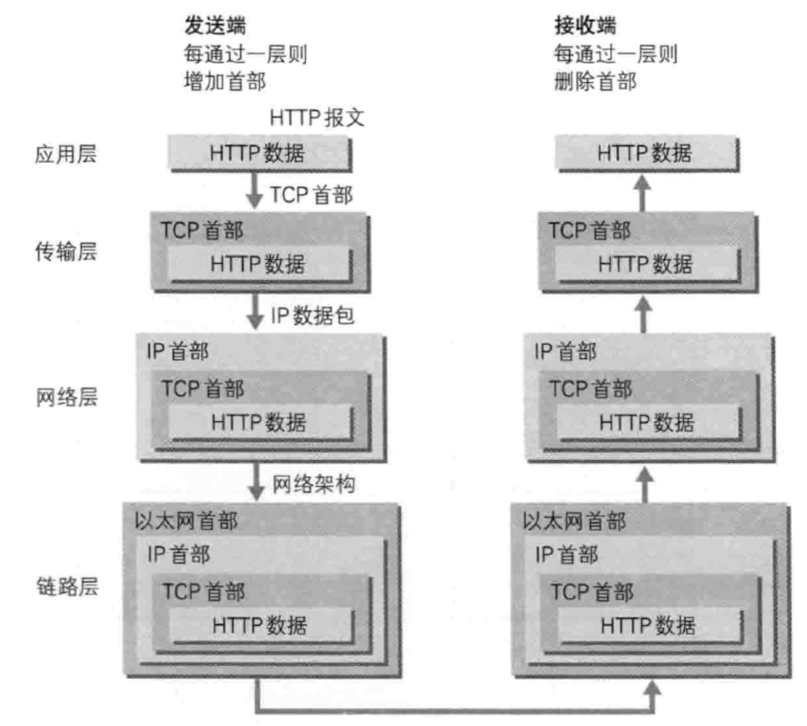
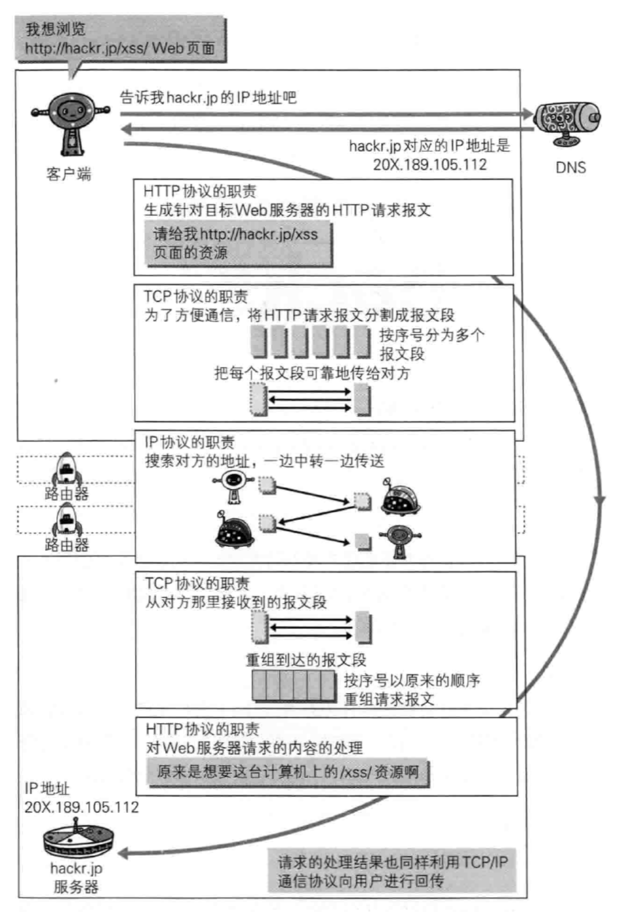
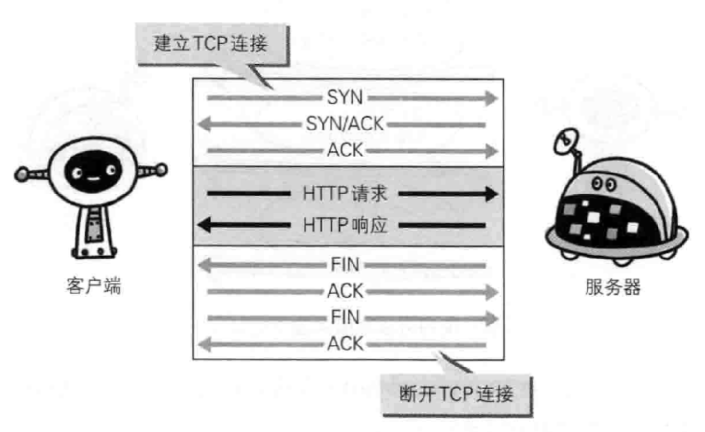
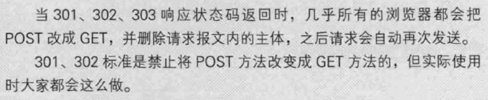
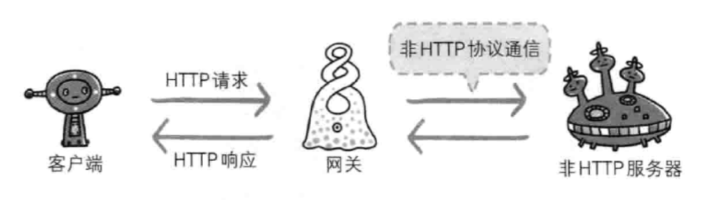

# 每天30页

## 第一章

### 1.1
web是建立在http协议上通信的。

### 1.2
SGML 标准通用标记语言

### 1.3
http属于tcp/ip内部的一个子集

tcp/ip 4层：应用层、传输层、网络层、数据链路层。

应用层：ftp、dns、http

传输层：tcp、udp

网络层：处理网络上流动的数据包

链路层：处理连接网络硬件部分：操作系统，硬件，网卡

### 1.4

负责传输的IP协议

IP网际协议位于网络层

ARP解析地址的协议，根据通信方的IP地址就可以反查出对应的mac地址

确保可靠性的TCP协议

TCP协议把大数据分割成报文段，能够确认最终是否能送达对方

三次握手：1.syn标志 2.syn ack 标志  3.ack标志

dns：域名到IP地址解析

## 第二章

### 2.2

请求报文由请求方法，请求uri，协议版本，可选的请求首部字母和内容实体构成。

响应报文由协议版本，状态码，解释状态码的原因短语，可选的响应首部字段以及实体主体构成

### 2.3

http是无状态的，因为这样可以处理大量事务，确保协议的可伸缩性。但有了cookie就可以管理状态了。

### 2.5

If-Modified-Since: 时间 -> 返回时间以后更新过的资源，如未更新 状态码是304 not modified

302 暂时重定向

PUT：传输文件

HEAD：获得报文首部

http/1.1 PUT 和 DELETE不带验证机制 所以一般不使用

OPTIONS：询问支持的方法

TRACE：追踪路径

CONNECT：要求用隧道协议连接代理

### 2.7

http协议初版，每进行一次http通信，就要断开一次TCP连接

故 http/1.1 和部分 http/1.0 想出持久连接：只要任意一端没有明确提出断开连接，则保持TCP连接 -> 建立一次TCP连接后进行多次请求和响应的交互

http/1.1 默认都是持久连接

持久连接使得多数请求可以并发发送

### 2.8

cookie：通过在请求和响应中写入cookie信息来控制客户端的状态

响应报文：Set-Cookie的首部字段信息，通知客户端保存cookie，客户端在请求报文加入Cookie值后发送。服务端拿到cookie后，对比记录，拿到以前的相应状态信息。

## 第三章

### 3.1

http报文：报文首部 报文主体（可选） 两者由空行划分

### 3.4

MIME多用途因特网邮件扩展

1. multipart/form-data
2. multipart/byteranges 状态码206（partial content）

### 3.5

为防止网络中断，重新下载的情况，可以指定范围发送请求，叫范围请求：会用到首部字段Range来指定资源的byte范围。

Range: bytes=5001-10000

Range: bytes=5001-

Range: bytes=-3000， 5000-7000

针对范围请求，响应返回206，多重范围，首部字段Content-Type 有 multipart/byteranges，服务器无法响应范围请求，会返回200和完整数据

### 3.6

内容协商：相同URI出现不同语言

内容协商基准
- Accept
- Accept-Charset
- Accept-Encoding
- Accept-Language
- Content-Language

## 第四章

### 4.2

204 No Content 请求成功，但没有资源返回

206 范围请求

301 永久重定向

302 临时重定向

303 请求的资源存在另一个URI上，且用get方法获取资源

304 服务端允许请求访问资源，但未满足条件，就会返回304，不包含任何响应主体部分。这个与重定向无关

307 临时重定向，与302类似，不会把post变化成get

400 请求报文存在错误

401 请求需要通过http认证

403 请求资源被服务器拒绝

500 服务器错误

503 服务器超负载，或在进行停机维护

## 第五章

### 5.1

单台虚拟主机可以实现多个域名访问，但是dns解析后ip地址会相同，所以必须要在请求首部指定Host，即主机名或域名的URI

### 5.2

通信数据转发程序：代理、网关、隧道

网关可以连接数据库，使用sql语句查询数据

## 第六章

通用首部字段： Via: 代理服务器的相关信息

请求首部：If-Match 响应首部：Etag

6.3 P84

### 4.1

### 4.1

## 第四章

