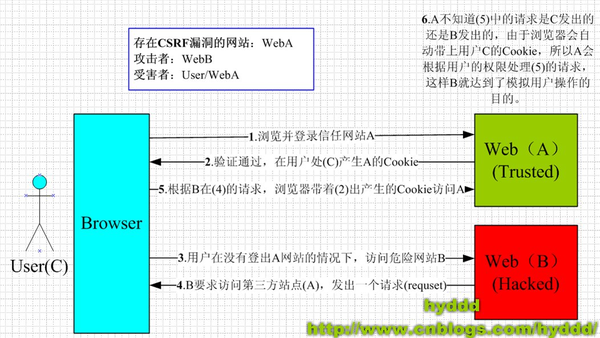

#### 头条面经

一面：

1. 手写bind实现 [Reference](https://blog.csdn.net/daimomo000/article/details/72897035)
```js
Function.prototype.bind2 = function(context) {
  let self = this;
  let [, ...args] = [...arguments];
  let ftem = function() {};
  let fbound =  function() {
    self.apply(this instanceof self ? this : context, args.concat([...arguments]));
  };
  ftem.prototype = this.prototype;
  fbound.prototype = ftem.prototype;
  return fbound;
}
```
2. flex 布局，实现上中下三块，上下固定，中间自适应 [Reference](http://www.ruanyifeng.com/blog/2015/07/flex-examples.html)
> 以下6个属性设置在container上:
> - flex-direction
> - flex-wrap
> - flex-flow
> - justify-content
> - align-items
> - align-content
>
> `flex-flow`属性是`flex-direction`属性和`flex-wrap`属性的简写形式，默认值为row nowrap。  
> `justify-content: flex-start(d) | flex-end | center | space-between | space-around;`  
> `align-items: flex-start | flex-end | center | baseline | stretch(d);`  
> `align-content: flex-start | flex-end | center | space-between | space-around | stretch(d);`  
> 
>
> 以下6个属性设置在item上:
> - order
> - flex-grow
> - flex-shrink
> - flex-basis
> - flex
> - align-self
>
> `flex-grow`属性定义项目的放大比例，默认为0，即如果存在剩余空间，也不放大。  
> `flex-shrink`属性定义了项目的缩小比例，默认为1，即如果空间不足，该项目将缩小。  
> `flex-basis`属性定义了在分配多余空间之前，项目占据的主轴空间（main size）。浏览器根据这个属性，计算主轴是否有多余空间。它的默认值为auto，即项目的本来大小。  
> `flex`属性是`flex-grow`, `flex-shrink` 和 `flex-basis`的简写，默认值为0 1 auto。后两个属性可选。


3. Http2.0 头部压缩，服务端推送，单一长连接，多路复用等 [Reference](https://blog.csdn.net/g6U8W7p06dCO99fQ3/article/details/78906348)
> 长连接:  
HTTP 1.1支持长连接（PersistentConnection）和请求的流水线（Pipelining）处理，在一个TCP连接上可以传送多个HTTP请求和响应，减少了建立和关闭连接的消耗和延迟，在HTTP1.1中默认开启Connection： keep-alive，一定程度上弥补了HTTP1.0每次请求都要创建连接的缺点。
>
> 多路复用:  
允许同时通过单一的 HTTP/2 连接发起多重的请求-响应消息。有了新的分帧机制后，HTTP/2 不再依赖多个TCP 连接去实现多流并行了。每个数据流都拆分成很多互不依赖的帧，而这些帧可以交错（乱序发送），还可以分优先级。最后再在另一端把它们重新组合起来。HTTP 2.0 连接都是持久化的，而且客户端与服务器之间也只需要一个连接（每个域名一个连接）即可。
> 
> 服务端推送  
>- 服务器可以对一个客户端请求发送多个响应。服务器向客户端推送资源无需客户端明确地请求。
>- HTTP 2.0 连接后，客户端与服务器交换SETTINGS 帧，借此可以限定双向并发的流的最大数量。
>- 所有推送的资源都遵守同源策略。换句话说，服务器不能随便将第三方资源推送给客户端，而必须是经过双方确认才行。  
服务器必须遵循请求- 响应的循环，只能借着对请求的响应推送资源
>
> 服务器推送到底是什么:  
服务端推送能把客户端所需要的资源伴随着index.html一起发送到客户端，省去了客户端重复请求的步骤。正因为没有发起请求，建立连接等操作，所以静态资源通过服务端推送的方式可以极大地提升速度。  
>
> header压缩:  
HTTP1.x的header带有大量信息，而且每次都要重复发送，HTTP/2使用encoder来减少需要传输的header大小，通讯双方各自cache一份header fields表，既避免了重复header的传输，又减小了需要传输的大小。
>


4. https 和 http 区别
>HTTPS和HTTP的区别主要如下：
>- https协议需要到ca申请证书，一般免费证书较少，因而需要一定费用。
>- http是超文本传输协议，信息是明文传输，https则是具有安全性的ssl加密传输协议。
>- http和https使用的是完全不同的连接方式，用的端口也不一样，前者是80，后者是443。
>- http的连接很简单，是无状态的；HTTPS协议是由SSL+HTTP协议构建的可进行加密传输、身份认证的网络协议，比http协议安全。
>
5. 跨域的几种方法，以及什么是跨域 [Reference](http://www.ruanyifeng.com/blog/2016/04/same-origin-policy.html)
> 跨域方法:
> 1. jsonp跨域：在js中，我们直接用XMLHttpRequest请求不同域上的数据时，是不可以的。但是，在页面上引入不同域上的js脚本文件却是可以的，jsonp正是利用这个特性来实现的。
> 2. 修改document.domain跨子域：document.domain的设置是有限制的，我们只能把document.domain设置成自身或更高一级的父域，且主域必须相同。例如：a.b.example.com 中某个文档的document.domain 可以设成a.b.example.com、b.example.com 、example.com中的任意一个，但是不可以设成 c.a.b.example.com,因为这是当前域的子域，也不可以设成baidu.com,因为主域已经不相同了。
> 3. window.name跨域：window.name的值只能是字符串的形式，大小约2M，根据浏览器不同。通过一个隐藏的代理iframe来跨域。
> 4. H5的window.postMessage跨域：window.onmessage = function(data) {}
> 5. 图片ping：常用于跟踪用户点击页面或动态广告曝光次数，但只能发送单向请求。
> 6. WebSocket：`WebSocket` 是 HTML5 开始提供的一种在单个 TCP 连接上进行全双工通讯的协议。基于多线程或多进程的服务器无法适用于 WebSockets，WebSockets 服务器端实现都需要一个异步服务器。Node 实现：Socket.IO
>
>
> 同源：指域名，协议，端口均相同。两个域名之间不能跨过域名来发送请求或者请求数据，否则就是不安全的，这种不安全也就是CSRF（Cross-site request forgery），中文名称：跨站请求伪造，也被称为：one click attack/session riding，缩写为：CSRF/XSRF。
>   
> xss：跨站脚本攻击(Cross Site Scripting) 恶意攻击者往Web页面里插入恶意Script代码，当用户浏览该页之时，嵌入其中Web里面的Script代码会被执行，从而达到恶意攻击用户的目的。  
> 阮一峰 受 DDoS 分布式拒绝服务(DDoS:Distributed Denial of Service)

1. 前端性能优化你知道有哪些点
> [Reference](http://www.ruanyifeng.com/blog/2015/09/web-page-performance-in-depth.html) "生成布局"（flow）和"绘制"（paint）这两步，合称为"渲染"（render）。提高网页性能，就是要降低"重排"和"重绘"的频率和成本，尽量少触发重新渲染。window.requestAnimationFrame() window.requestIdleCallback()
>
> 1. 减少HTTP请求
> 2. 减少对DOM的操作
> 3. 使用JSON格式来进行数据交换
> 4. 使用CDN加速（内容分发网络）
> 5. 精简CSS和JS文件 压缩图片和使用图片Sprite技术(好多个小图片合成1个大图片)

7. vue react生命周期：
> React:
> 1. `componentWillMount()` 组件初始化时只调用，以后组件更新不调用，整个生命周期只调用一次，此时可以修改state。
> 2. `componentDidMount()` 组件渲染之后调用，只调用一次。
> 3. `componentWillReceiveProps(nextProps)` 组件初始化时不调用，组件接受新的props时调用。
> 4. `shouldComponentUpdate(nextProps, nextState)` react性能优化非常重要的一环。组件接受新的state或者props时调用，我们可以设置在此对比前后两个props和state是否相同，如果相同则返回false阻止更新，因为相同的属性状态一定会生成相同的dom树，这样就不需要创造新的dom树和旧的dom树进行diff算法对比，节省大量性能，尤其是在dom结构复杂的时候
> 5. `componentWillUpdata(nextProps, nextState)` 组件初始化时不调用，只有在组件将要更新时才调用，此时可以修改state
> 6. `componentDidUpdate()` 组件初始化时不调用，组件更新完成后调用，此时可以获取dom节点。
> 7. `componentWillUnmount()` 组件将要卸载时调用，一些事件监听和定时器需要在此时清除。
>
> Vue: [img](../images/lifecycle.png)
> - beforeCreate
> - created
> - beforeMount
> - mounted
> - beforeUpdate
> - updated
> - beforeDestroy
> - destroyed

二面：

1. css：左图片固定，右div自适应（要考虑兼容性）
```
img {
  float: left;
  width: 20px;
}
.content {
  overflow: hidden;
}

<div class="fa">
  
  <div class="content">
    通过BFC来实现。。。
  </div>
</div>
```

2. 原生 js 实现 jQuery 的 on 方法
```js
Element.prototype.on = function (type, fn) {
  type = type.split(' ');
  for (let i = 0; i < type.length; i++) {
    window.addEventListener ? this.addEventListener(type[i], fn) : this.attachEvent('on' + type[i], fn);
  }
}
document.querySelector('.aon').on('click mouseover', function () {
  alert(this.innerHTML);
});
```

3. vue 双向绑定
> - [参考链接](https://www.cnblogs.com/libin-1/p/6893712.html)
```js
var Book = {}
var name = '';
Object.defineProperty(Book, 'name', {
  set: function (value) {
    name = value;
    console.log('你取了一个书名叫做' + value);
  },
  get: function () {
    return '《' + name + '》'
  }
})
 
Book.name = 'vue权威指南';  // 你取了一个书名叫做vue权威指南
console.log(Book.name);  // 《vue权威指南》
```

> vue数据双向绑定是通过数据劫持结合发布者-订阅者模式的方式来实现的。vue是通过Object.defineProperty()来实现数据劫持的。
>因为view更新data其实可以通过事件监听即可，比如input标签监听 'input' 事件就可以实现了。通过Object.defineProperty( )对属性设置一个set函数，当数据改变了就会来触发这个函数，所以我们只要将一些需要更新的方法放在这里面就可以实现data更新view了。
>


1. for in 和 for of 区别
> - for in是ES5标准，遍历key，key总是字符串，适合遍历对象，会把原形链的也遍历出来。
> - for of是ES6标准，遍历value，value可以为数字，适合遍历数组。
5. let const var 区别
> - const定义的变量不可以修改，而且必须初始化。
> - var定义的变量可以修改，如果不初始化会输出undefined。
> - let是块级作用域，无变量提升，有暂时性死区，禁止重复声明变量，let不会成为全局对象的属性
```
// 暂时性死区
var foo = 3;
if (true) {
    foo = 5; // Uncaught ReferenceError
    let foo;
}
```

三面：

1. 设计 v-model
> `v-bind:value="name" v-on:input="name = $event.target.value"`
2. 平时有哪些你觉得自己写的很好的代码？
3. Reselect 原理
4. 感兴趣的新技术？
> Electron golang node express koa canvas(实现高性能Native App) webpack
5. 将来方向？
> 学精前端 再 算法工程师
6. 移动端适配方案
> - `<meta name="viewport"  content="width=width=device-width user-scalable=no, initial-scale=1.0">`
> - flex布局 媒介查询
> - vm/vh:CSS单位
> - rem
> - 视口 dip 设备独立像素

7. rem
> em: 避免1.2 * 1.2= 1.44的现象。比如说你在#content中声明了字体大小为1.2em，那么在声明p的字体大小时就只能是1em，而不是1.2em  
> rem: rem是CSS3新增的一个相对单位，相对的只是HTML根元素

8. 对京东技术的了解
> 京东金融，618，京东物流
9. react setState异步还是同步
>关于setState ,我们首先要有个正确的认识，官网中给出的解释是setState不是保证同步的
这说明它有时候是同步的有时候的异步的，那什么时候是同步，什么时候是异步？
答案是在React库控制之内时，它就会以异步的方式来执行，否则以同步的方式执行。
但大部份的使用情况下，我们都是使用了React库中的组件，例如View、Text、Image等等，
它们都是React库中人造的组件与事件，是处于React库的控制之下，在这个情况下，
setState就会以异步的方式执行。一般理解为this.state的值会在DOM中渲染，其他的情况比如取token,作为接口的参数的你setState是同步的

10. promise，anync，await的应用
>promise存在的问题
> - promise一旦执行，无法中途取消
> - promise的错误无法在外部被捕捉到，只能在内部进行预判处理
> - promise的内如何执行，监测起来很难  
> 正是因为这些原因，ES7引入了更加灵活多变的async，await来处理异步。
> `async function() {await new Promise()}`

亲身面经：

1. 项目介绍
> php新闻发布系统：mysql处理换行，chrome缓存。  
> 商家外卖app：css贝赛尔曲线， JSONP  
> 实习：问题管理系统，datatables
2. 最难忘的代码经历
> php 新闻：因为我第一次接触后台，第一次把前后端的联系理清了一些。再加上学校没教php，全靠自学，印象较深。
3. 最喜欢的数据结构
> 树：线段树  
> 算法： 莫队算法，动态规划，状压dp，二分，快速幂
