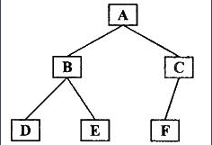

### 2018-10-12 11:45 补充
#### js数据类型
五种基本数据类型（Number,String,Boolean,Undefined,Null）,和一种复杂数据类型（Object），和ES6的Symbol
```js
typeof    undefined   //Undefined
typeof    null        //Object
typeof    { }           //Object
typeof    [ ]           //Object
typeof    console.log()       //Function
```
js三大引用类型：Object类型 Array类型 Function类型

#### call返回值
`call()`方法在使用一个指定的this值和若干个指定的参数值的前提下调用某个函数或方法。所以，你调用的方法的返回值就是你所谓的call的返回值了。

bind()返回的是一个绑定的this的函数。

#### bind实现
```js
// 第一版 不带参数
Function.prototype.bind2 = function(context) {
  var self = this;
  return function() {
    self.apply(context);
  }
}


```

#### slice()和splice()区别
`slice(start,end)`方法可从已有数组中返回选定的元素，返回一个新数组，包含从start到end（不包含end）的数组元素（不改变原数组）

`splice(index,howmany,item1,...itemX)`方法向或者从数组中添加或者删除项目，返回被删除的项目（会改变原数组）


#### 链式调用
```js
// 链式调用，返回类型要与prototype一致，this代表调用函数的对象
Number.prototype.add = function (val) {
  return Number(this + val);
}
Number.prototype.minues = function (val) {
  return Number(this - val);
}
Number.prototype.getResult = function () {
  return Number(this);
}
var num = (5).add(2).minues(3).getResult(); 
cc('num', num);  // 4
```

---


### 2018-10-12 01:53 补充
#### flex居中
.fa和.son固定宽高，.fa设置`justify-content: center; align-items: center;`，是`align-items`，因为`align-content`属性定义了多根轴线的对齐方式。如果项目只有一根轴线，该属性不起作用。

#### __proto__ & prototype
`__proto__`是每个对象都有的一个属性，而`prototype`是函数才会有的属性。

几乎所有的函数（除了一些内建函数）都有一个名为prototype（原型）的属性，这个属性是一个指针，指向一个对象，而这个对象的用途是包含可以有特定类型的所有实例共享的属性和方法。prototype是通过调用构造函数而创建的那个对象实例的原型对象。hasOwnProperty()判断指定属性是否为自有属性；in操作符对原型属性和自有属性都返回true。 

```js
// Identify whether it is a prototype property
function hasPrototypeProperty(obj, name) {
  return name in obj && !obj.hasOwnProperty(name);
}
// hasOwnProperty只查是否为自己的，而in是原型和OwnPrototype都会查
```
对象具有属性`__proto__`，可称为隐式原型，**一个对象的`__proto__`指向构造该对象的构造函数的原型**，这也保证了实例能够访问在构造函数原型中定义的属性和方法。

`isPrototypeOf()`方法用于测试一个对象是否存在于另一个对象的原型链上。  
`instanceof`运算符用于测试构造函数的prototype属性是否出现在对象的原型链中的任何位置

两者的区别主要是：

- A.isPrototypeOf(B) 判断的是A对象是否存在于B对象的原型链之中
- A instanceof B  判断的是B.prototype是否存在与A的原型链之中

那么：如果 A.isPrototypeOf(B) 返回true 则B instanceof A 一定返回true

#### 多态 & 重载
封装可以隐藏实现细节，使得代码模块化；继承可以扩展已存在的代码模块（类）；它们的目的都是为了——代码重用。而多态除了代码的复用性外，还可以解决项目中紧偶合的问题,提高程序的可扩展性。

多态的两个好处：
1. 应用程序不必为每一个派生类编写功能调用，只需要对抽象基类进行处理即可。大大提高程序的可复用性。（继承）
2. 派生类的功能可以被基类的方法或引用变量所调用，这叫向后兼容，可以提高可扩充性和可维护性。（多态的真正作用）

重载：有多个函数的名字相同，但是形参列表不同(参数类型不同或参数个数不同)

#### loader和plugin
对于loader，它就是一个转换器，将A文件进行编译形成B文件，这里操作的是文件，比如将A.scss或A.less转变为B.css，单纯的文件转换过程

对于plugin，它就是一个扩展器，它丰富了wepack本身，针对是loader结束后，webpack打包的整个过程，它并不直接操作文件，而是基于事件机制工作，会监听webpack打包过程中的某些节点。


---


#### You-Dont-Need-Momentjs
List of date-fns or native functions which you can use to replace moment.js + ESLint Plugin

#### chinese-dos-games
Chinese DOS games in browser.


####  ky
Tiny and elegant HTTP client based on the browser Fetch API
除了XMLHttpRequest对象来获取后台的数据之外，还可以使用一种更优的解决方案fetch。


#### javascript-algorithms
Algorithms and data structures implemented in JavaScript with explanations and links to further readings


#### f2
An elegant, interactive and flexible charting library for mobile.


#### axios
Promise based HTTP client for the browser and node.js
- 从浏览器中创建 XMLHttpRequests
- 从 node.js 创建 http 请求
- 支持 Promise API
- 拦截请求和响应
- 转换请求数据和响应数据
- 取消请求
- 自动转换 JSON 数据
- 客户端支持防御 XSRF

#### v86
x86 virtualization in JavaScript, running in your browser and NodeJS


## 杂知识：

**箭头函数**
1. 函数体内的this对象，就是定义时所在的对象，而不是使用时所在的对象。
2. 不可以当作构造函数，也就是说，不可以使用new命令，否则会抛出一个错误。
3. 不可以使用arguments对象，该对象在函数体内不存在。如果要用，可以用 rest 参数代替。
4. 不可以使用yield命令，因此箭头函数不能用作 Generator 函数。
上面四点中，第一点尤其值得注意。this对象的指向是可变的，但是在箭头函数中，它是固定的。


**Object.assign**
Object.assign方法实行的是浅拷贝，而不是深拷贝。也就是说，如果源对象某个属性的值是对象，那么目标对象拷贝得到的是这个对象的引用。

**WeakSet**
1. WeakSet 成员只能够是对象 
2. 作为 WeakSet 成员的对象都是弱引用，即垃圾回收机制不考虑 WeakSet 对该对象的引用，也就是说，如果其他对象都不再引用该对象，那么垃圾回收机制会自动回收该对象所占用的内存，不考虑该对象还存在与WeakSet之中。这个特点意味着，无法引用WeakSet的成员，因此WeakSet是不可遍历的。
3. 使用WeakSet存储对象实例的好处是，由于是对对象实例的引用，不会被计入内存回收机制，所以删除实例的时候，不用考虑weaket，也不会出现内存泄漏。

**网络协议**
TCP和IP分别对应了OSI中的哪几层？

- 网络层协议：IP、ARP、RARP、ICMP、IGMP、OSPF
- 传输层协议：TCP、UDP、SCTP
- 应用层协议：http，FTP、SMTP、RIP、DNS

在讲HTTP/2之前我们先来说说SPDY：  
SPDY协议是Google提出的基于传输控制协议(TCP)的应用层协议，通过 *压缩* 、 *多路复用* 和 *优先级* 来缩短加载时间。该协议是一种更加快速的内容传输协议，于2009 年年中发布。


OSI七层模型分为
> - 物理层
> - 数据链路层
> - 网络层
> - 传输层
> - 会话层
> - 表示层
> - 应用层


分布式拒绝服务(DDoS:Distributed Denial of Service)攻击指借助于客户/服务器技术，将多个计算机联合起来作为攻击平台，对一个或多个目标发动DDoS攻击，从而成倍地提高拒绝服务攻击的威力。通常，攻击者使用一个偷窃帐号将DDoS主控程序安装在一个计算机上，在一个设定的时间主控程序将与大量代理程序通讯，代理程序已经被安装在网络上的许多计算机上。代理程序收到指令时就发动攻击。利用客户/服务器技术，主控程序能在几秒钟内激活成百上千次代理程序的运行。

XSS利用站点内的信任用户，而 **CSRF则通过伪装来自受信任用户的请求来利用受信任的网站** 。与XSS攻击相比，CSRF攻击往往不大流行（因此对其进行防范的资源也相当稀少）和难以防范，所以被认为比XSS更具危险性。

防止CSRF：Cookies+Token


TCP的优点： 可靠，会有三次握手来建立连接。 缺点： 慢，效率低，占用系统资源高；因为TCP有确认机制、三次握手机制，这些也导致TCP容易被人利用，实现DOS、DDOS、CC等攻击。

UDP的优点： 快，比TCP稍安全 UDP没有TCP的握手、确认、窗口、重传、拥塞控制等机制，UDP是一个无状态的传输协议，所以它在传递数据时非常快，UDP较TCP被攻击者利用的漏洞就要少一些。缺点： 不可靠，不稳定

常用TCP协议：用的，http，邮箱，QQ文件传输  
常用UDP协议：QQ语音 QQ视频

TCP面向字节流，UDP是面向报文的

SSH 为 Secure Shell 的缩写，SSH 为建立在应用层基础上的安全协议，专为远程登录会话和其他网络服务提供安全性的协议。


#### 先中后序遍历


前序遍历的规则：
1. 访问根节点
2. 前序遍历左子树
3. 前序遍历右子树

前序遍历的输出结果：ABDECF

中序遍历的规则：
1. 中序遍历左子树
2. 访问根节点
3. 中序遍历右子树

中序遍历的输出结果：DBEAFC

后序遍历二叉树的规则：
1. 后序遍历左子树
2. 后序遍历右子树
3. 访问根节点

后序遍历的输出顺序：DEBFCA
