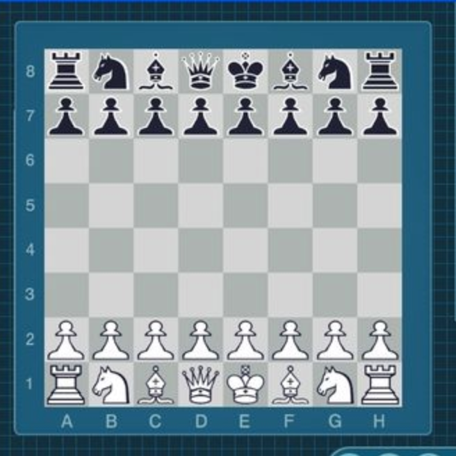
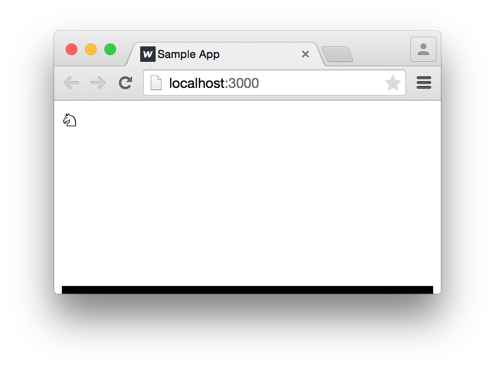
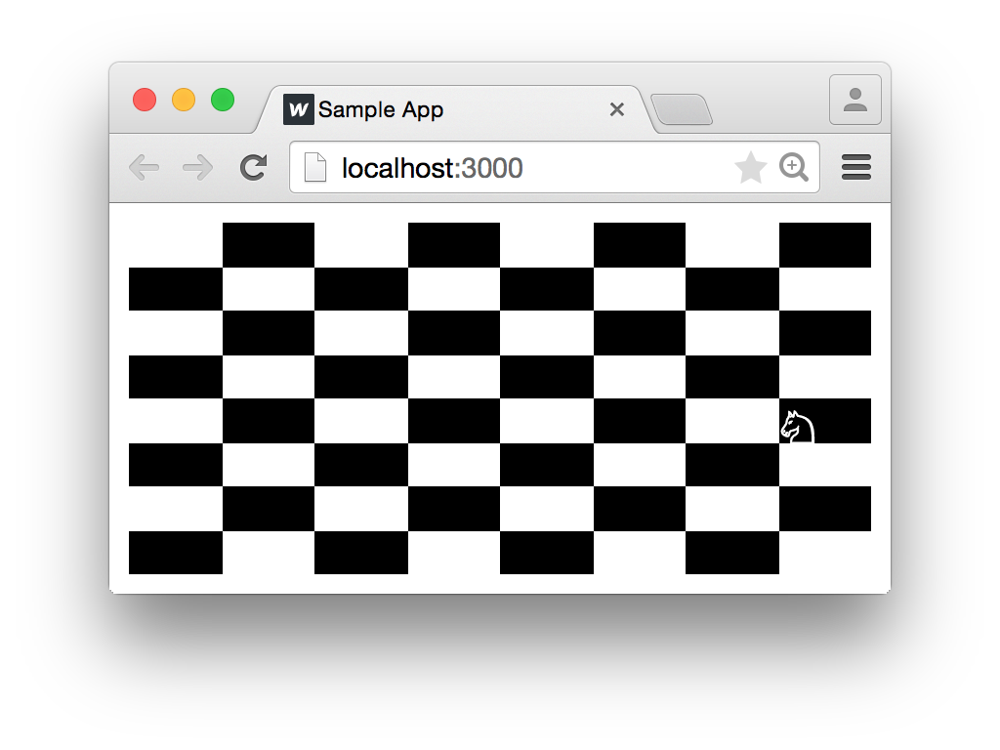
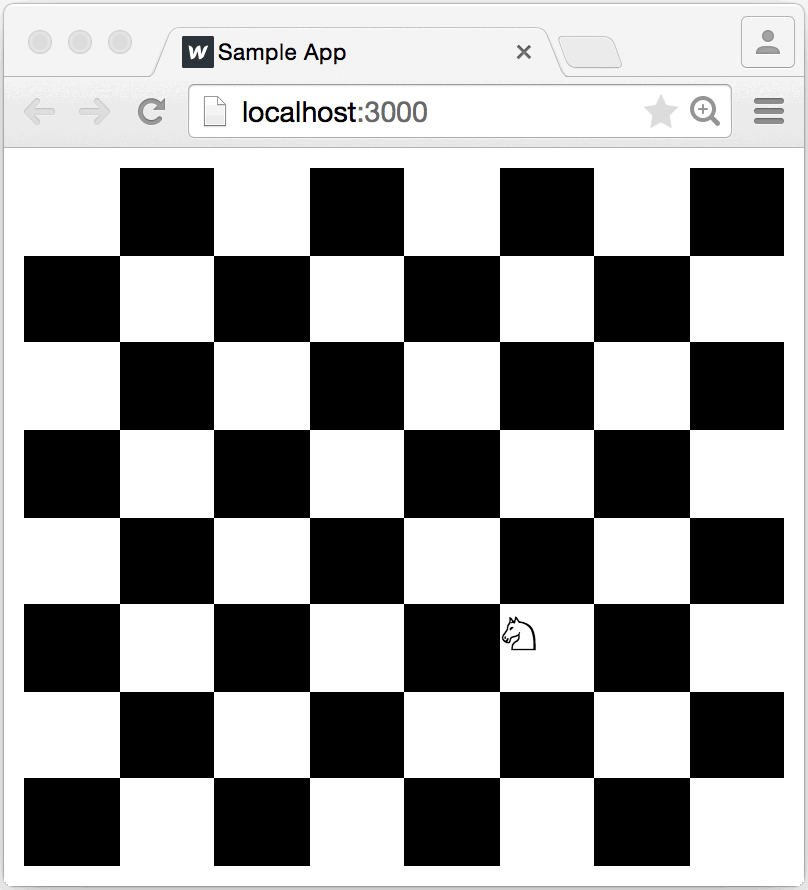

# Tutorial

> 译者注：小弟才疏学浅，错误在所难免，欢迎赐教。

你已经阅读了 [Overview](http://react-dnd.github.io/react-dnd/docs/overview)  [中文Overview地址](https://github.com/AnHongpeng/react-dnd-in-chinese/blob/master/docs/quickStart/overview.md)（译者在GitHub上看到的），现在开始我们的冒险！ 即使你没有阅读，也是不妨碍我们的，因为我们 2/3 的时间将忙于识别和构建正常的React组件，就像 Thinking in React 教程中一样。 添加拖放支持只是锦上添花。

在本教程中，我们将使用React和React DnD构建一个Chess游戏。 这当然是不可能的啦！编写一个完整的国际象棋游戏完全超出了本教程的范围。 **我们要构建的是一个带棋盘和一个骑士小应用, 根据国际象棋规则，骑士可以被拖拽。**

我们将使用此示例来演示React DnD的数据驱动方法。 您将学习如何创建拖动源（drag source）和放置目标（drop target），将它们与组件连接在一起，并根据拖放事件更改其外观。

如果您是对React只有一点了解的新手，但是必须获得构建组件的一些经验，本教程还可以作为React思维模式和React工作流程的介绍。 **如果您是经验丰富的React开发人员，并且只是来到拖放部分，您可以直接阅读本教程的第三部分和最后一部分。**

闲话少说！ 是时候为我们的小项目设置构建工作流程了。 我使用Webpack，你可能使用Browserify。我现在并不想讨论这个，所以只要能以方便的方式创建一个空的React项目即可。 如果你觉得麻烦，你当然也可以克隆[React Hot Boilerplate](https://github.com/gaearon/react-hot-boilerplate)并在它上面工作。 其实，这就是我将要做的事情。


在本教程中，代码示例使用函数组件（function-components）和现代JavaScript语法。 建议使用构建工具将这些功能转换为目标环境可执行的代码。 我们建议使用[create-react-app](https://github.com/facebook/create-react-app)。

我们要构建的应用程序可在[这里](http://react-dnd.github.io/react-dnd/examples/tutorial)看见（国内不稳定）。


## 拆分组件

我们首先将创建一些React组件，而不考虑拖放交互。 我们的小骑士（Lonely Knight）应用程序将由哪些组件组成？ 我能想到几点：

- `Knight`：我们孤独的骑士;
- `Square`：面板上的一个方块;
- `Board`：面板共有64个方块。

让我们考虑一下他们的props：

- `Knight`可能不需要props。 它有一个位置，但`Knight`不需要知道它，因为它可以放置在一个`Square`的子节点中。

- 通过props告诉`Square`的位置也许不错，但这也没有必要，因为渲染需要的唯一信息就是颜色。 我默认会将Square设为白色，并添加一个黑色布尔值props。 当然，`Square`可能会接受一个子节点：目前正在上面的棋子。 我选择白色作为默认背景颜色以对应浏览器默认颜色。


- `Board`会很难搞。 将Squares作为孩子传递给它是没有意义的，因为`Board`还可能包含别的玩意吗？ 

因此它可能拥有Squares。（ Therefore it probably owns the Squares.）

 但是，它还需要拥有`Knight`，因为`Knight`需要被放置在其中一个`Square`中。 这意味着`Board`需要知道`Knight`的当前位置。 在一个真正的国际象棋游戏中，`Board`将接受描述所有部分，颜色和位置的数据结构，但对我们来说，一个knightPosition props就够了。 我们将使用二维数组作为坐标，[0,0]指的是A8位置。 为什么是A8而不是A1？ 因为可以匹配浏览器坐标方向。 我用A1试了一下，感觉又掉了好几根头发。
 


那么state放哪？ 我真的不想把它放到`Board`组件中。 最好在组件中尽可能少地使用state，并且因为`Board`组件已经有了一些布局逻辑，所以我不想再同时管理state，导致给它带来额外负担。

好消息是，这点无关紧要。 我们只需要专注编写组件即可，就好像state已经在某个地方存在了，接着确保它们在通过props接收时正确展现，后面再考虑管理state就行！

## 创建组件

我更喜欢自下而上的来创建组件，因为这样我总是能使用已经存在的东西。 如果我先建立`Board`，在完成`Square`之前我是看不到结果的。 再者，我可以立即写完就能看的`Square`，而不用去思考`Board`该怎样。 我认为即时的反馈循环很重要（你可以通过我的[另一个项目](https://gaearon.github.io/react-hot-loader/)来看出这点）

那么我们从`Knight`开始，它根本就没props，也是最容易写的。
```js
import React from 'react';

export default function Knight() {
  return <span>♘</span>;
}
```
是的，♘是Unicode字符中的骑士！ 贼帅气。 我们可以把它的颜色当一个属性，然鹅在我们的例子中没黑色骑士，所以没啥必要。

它似乎render的没啥问题，但只是为了保险，我还是改变了我的入口来测试它：

```js
import React from 'react';
import ReactDOM from 'react-dom';
import Knight from './Knight';

ReactDOM.render(<Knight />, document.getElementById('root'));
```


每次我处理一个组件时，我都会这样做，所以我总要渲染一些东西。 在一个更大的应用程序中，我会使用像[cosmos](https://github.com/react-cosmos/react-cosmos)这样的component playground，所以我永远不会在黑盒中写组件。

我在屏幕上看到了我的骑士！ 现在是时候开始实现`Square`了。 这是我的第一次尝试：
```js
import React from 'react';

export default function Square({black}) {
  const fill = black ? 'black' : 'white';
  return <div style={{ backgroundColor: fill }} />;
}
```

现在，我改变一下入口代码，来看一下`Knight`在`Square`中是怎样的
```js
import React from 'react';
import ReactDOM from 'react-dom';
import Knight from './Knight';
import Square from './Square';

ReactDOM.render(
  <Square black>
    <Knight />
  </Square>,
  document.getElementById('root')
);
```

扎心了，啥玩意也没有啊，我其实犯了以下错误：
- 我忘了给Square大小，所以它高度就会坍塌为0。 我不希望它有任何固定的大小，所以我会给它宽度：'100％'和高度：'100％'来填满容器。

- 我忘了将{children}放在Square返回的div中，所以它忽略了Knight传递给它的内容。


即使在纠正了这两个问题之后，当`Square`变黑时我仍然看不到我的骑士。 这是因为默认的页面正文文本颜色是黑色，因此在黑色方块上看不到。 我可以通过给`Knight`一个颜色道具来解决这个问题，但更简单的解决方法是在我设置backgroundColor的t同时设置相应的显示颜色样式。 这个版本的`Square`纠正了错误，并且对两种颜色同样有效：

```js
import React from 'react';

export default function Square({black, children}) {
  const fill = black ? 'black' : 'white';
  const stroke = black ? 'white' : 'black';

  return (
    <div style={{
      backgroundColor: fill,
      color: stroke,
      width: '100%',
      height: '100%'
    }}>
      {children}
    </div>
  );
}
```


最后，开始写`Board`！ 我将从一个最简单的版本开始，只绘制一个`Square`：

```js
import React from 'react';
import Square from './Square';
import Knight from './Knight';

export default function Board() {
  return (
    <div>
      <Square black>
        <Knight />
      </Square>
    </div>
  );
}
```
目前，我唯一的目的是让它render，以便我可以开始调试它：

```js
import React from 'react';
import ReactDOM from 'react-dom';
import Board from './Board';

ReactDOM.render(
  <Board knightPosition={[0, 0]} />,
  document.getElementById('root')
);
```

的确，我可以看到一个方块。 我现在要添加所有的方块！ 但我应该从哪里开始？ 我应该把render放哪？for循环？ 或数组的map？

讲真，我其实现在也不用考虑这个。 我已经知道如何渲染一个有骑士或没有骑士的方格。 由于knightPosition props，我也知道了骑士的位置。 这样我就可以写一个renderSquare方法，而不用担心怎么渲染整个`Board`。

我的第一版 renderSquare 方法如下：

```js
function renderSquare(x, y, [knightX, knightY]) {
  const black = (x + y) % 2 === 1;
  const isKnightHere = knightX === x && knightY === y
  const piece = isKnightHere ? <Knight /> : null;

  return (
    <Square black={black}>
      {piece}
    </Square>
  );
}
```

我可以改变`Board`的render来写几个`Square`

```js
export default function Board({ knightPosition }) {
  return (
    <div style={{
      width: '100%',
      height: '100%'
    }}>
      {renderSquare(0, 0, knightPosition)}
      {renderSquare(1, 0, knightPosition)}
      {renderSquare(2, 0, knightPosition)}
    </div>
  );
}
```



现在，我发现我没有给方块任何布局。 那让我们来用Flex布局吧。 我在根div中添加了一些样式，并将Squares包装在div中，这样我就可以将它们展开了。 通常，保持组件的封装性并使它们的布局对外无感知是个好写法，即使要添加div来包裹。

```js
import React from 'react';
import Square from './Square';
import Knight from './Knight';

function renderSquare(i, [knightX, knightY]) {
  const x = i % 8;
  const y = Math.floor(i / 8);
  const isKnightHere = (x === knightX && y === knightY)
  const black = (x + y) % 2 === 1;
  const piece = isKnightHere ? <Knight /> : null;

  return (
    <div key={i} style={{ width: '12.5%', height: '12.5%' }}>
      <Square black={black}>
        {piece}
      </Square>
    </div>
  );
}

export default function Board({knightPosition}) {
  const squares = [];
  for (let i = 0; i < 64; i++) {
    squares.push(this.renderSquare(i, knightPosition));
  }

  return (
    <div style={{
      width: '100%',
      height: '100%',
      display: 'flex',
      flexWrap: 'wrap'
    }}>
      {squares}
    </div>
  );
}
```


这看起来很酷！ 但我现在不知道如何保持`Board`方形宽高比，但这很容易在以后添加。

我们从什么都没有，到现在能够通过改变knightPosition将骑士移动到棋盘其他位置：

```js
import React from 'react';
import ReactDOM from 'react-dom';
import Board from './Board';

ReactDOM.render(
  <Board knightPosition={[7, 4]} />,
  document.getElementById('root')
);
```


声明式（declarativeness）写法太爽了！这就是人们为什么喜欢用React的原因


## 添加State

我们想让 `Knight` 可以拖拽。 为了实现这一点，我们需要的是将当前的`knightPosition` 保持在某种状态存储中，并有一些方法来改变它。

因为设置这个 `state` 需要一些思考，所以我们不会同时实现拖动。 相反，我们将从更简单的实现开始。 只要你点击一个特定的 `Square` 时，我们会移动 `Knight` ，但前提是这符合国际象棋规则。 实现这个之后，可以给我们足够的想法来管理 `state` ，所以接着我们可以用拖放替换点击。

React并不反对数据管理或数据流; 你可以使用 [Flux](https://facebook.github.io/flux/) ，[Redux](https://github.com/reduxjs/react-redux) ，[Rx](https://github.com/Reactive-Extensions/RxJS) 等，避免使模型臃肿并将读写分离。

我不想因为这个简单的例子，来安装或设置Redux给我们带来麻烦，所以我将遵循一个更简单的模式。 它不会像Redux一样可扩展，但我也不需要它。 我还没有确定我的状态管理器的API，但是我将其称为Game，它肯定需要一些方法来向我的React代码发送信号，更改数据。

由于我知道这一点，我可以用一个尚不存在的假想 `Game` 重写我的 `index.js` 。 请注意，这一次，我是在盲目写代码，它还无法运行。 这是因为我还在考虑API：

```js
import React from 'react';
import ReactDOM from 'react-dom';
import Board from './Board';
import { observe } from './Game';

const root = document.getElementById('root');

observe(knightPosition =>
  ReactDOM.render(
    <Board knightPosition={knightPosition} />,
    root
  )
);
```

我import的 `observe` 是干嘛的呀？这只是我能想到的用来订阅变化 `state` 的最小方法。 我虽然可以把它变成一个 `EventEmitter` ，但我需要的只是一个简单的变化事件，那为什么还要怎么做呢？ 我本可以让 `Game` 成为一个对象模型，但我需要的只是一个数据流，所以这也没有必要。

为了验证这个订阅API的意义，让我们写一个发布随机位置的代码：
```js
export function observe(receive) {
  setInterval(() => receive([
    Math.floor(Math.random() * 8),
    Math.floor(Math.random() * 8)
  ]), 500);
}
```

> 译者注：这块代码写的好神奇，先是定义了一个函数 `observe` 这个函数有一个参数，之后 `index.js` 中调用 `observe` 传进去的参数是一个函数，这时会执行 `observe` ，接着调用传进来的参数（其实是一个函数），并给这个参数一个参数（是2个值的数组）最后就会每500ms调用 `ReactDOM.render` 来生成图像。

回到render完成的Game中，看起来真不错！




但很明显，这没啥用。如果我们想要一些交互，就要能在我们的组件中去修改 `Game` 的state。

现在，我保持简单并暴露一个直接修改内部状态的 `moveKnight` 函数。 在中等复杂的应用中，这样做不是很好，因为不同的state存储可能会被响应单个用户操作更新而影响，但在我们的情况下，这就足够了：

```js
let knightPosition = [0, 0];
let observer = null;

function emitChange() {
  observer(knightPosition);
}

export function observe(o) {
  if (observer) {
    throw new Error('Multiple observers not implemented.');
  }

  observer = o;
  emitChange();
}

export function moveKnight(toX, toY) {
  knightPosition = [toX, toY];
  emitChange();
}
```

现在，回到我们的组件。 此时的目标是将 `Knight` 移动到被点击的 `Square` 。 一种方法是在 Square 中调用 moveKnight 。 但是，这需要让我们把 `Knight` 的位置传递给 `Square` 。 下面有一个更好的办法：

> 如果一个组件为了渲染不需要使用state，那么他根本就不需要state

`Square` 不需要知道 `Knight` 的位置，因此最好避免把 `moveKnight` 方法耦合到 `Square` 中，所以我们给包裹 `Square` 的 `div` 添加一个 `onClick` handler，而不是给 `Board` 加。


```js
import React from 'react';
import Square from './Square';
import Knight from './Knight';
import { moveKnight } from './Game';

/* ... */

renderSquare(i, knightPosition) {
  /* ... */
  return (
    <div onClick={() => this.handleSquareClick(x, y)}>
      {/* ... */}
    </div>
  );
}

handleSquareClick(toX, toY) {
  moveKnight(toX, toY);
}
```
我们本可以在 `Square` 上添加一个 `onClick` props并使用它，但是因为我们要在以后删除点击处理程序以支持拖放界面，那为什么还要麻烦一次呢？

现在最后剩下的部分是国际象棋规则检查。 骑士不能任意移动，只允许进行L形移动。 那么向游戏中添加一个 `canMoveKnight(toX，toY)` 函数，并将初始位置更改为A2以匹配规则：

```js
let knightPosition = [1, 7];

/* ... */

export function canMoveKnight(toX, toY) {
  const [x, y] = knightPosition;
  const dx = toX - x;
  const dy = toY - y;

  return (Math.abs(dx) === 2 && Math.abs(dy) === 1) ||
         (Math.abs(dx) === 1 && Math.abs(dy) === 2);
}
```

最后，在move之前，我要检查一下：

```js
import { canMoveKnight, moveKnight } from './Game';

/* ... */

handleSquareClick(toX, toY) {
  if (canMoveKnight(toX, toY)) {
    moveKnight(toX, toY);
  }
}
```


现在这样，真好！


`Knight`
`Square`
`Board`
```js

```
