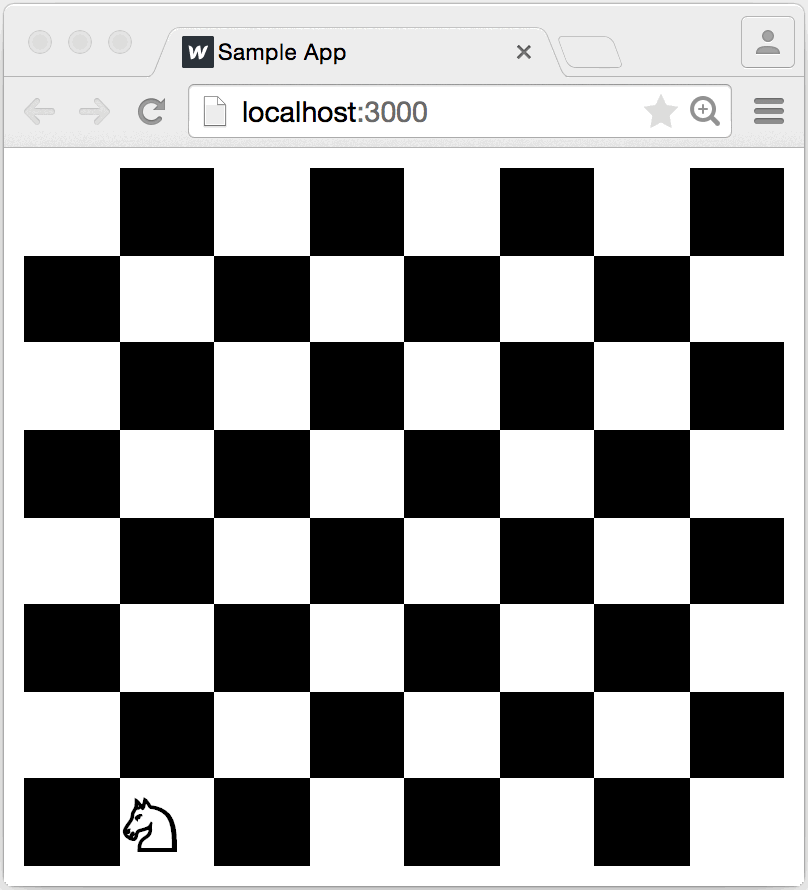
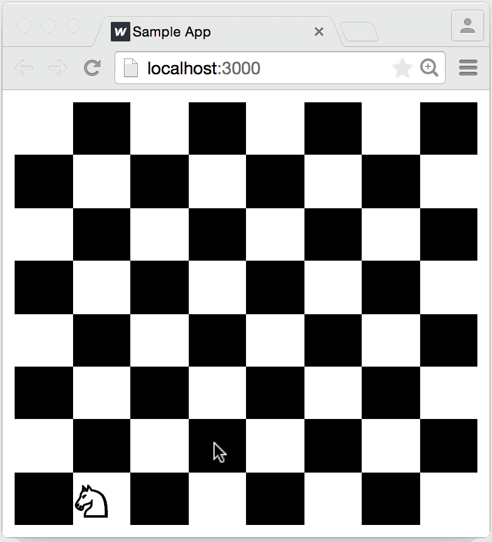

# Tutorial

> 译者注：小弟才疏学浅，错误在所难免，欢迎PR

你已经阅读了 [Overview](http://react-dnd.github.io/react-dnd/docs/overview)，现在开始我们的冒险！ 即使你没有阅读，也是不妨碍我们的，因为我们 2/3 的时间将忙于识别和构建正常的React组件，就像 Thinking in React 教程中一样。 添加拖放支持只是锦上添花。

在本教程中，我们将使用React和React DnD构建一个Chess游戏。 这当然是不可能的啦！编写一个完整的国际象棋游戏完全超出了本教程的范围。 **我们要构建的是一个带棋盘和一个骑士小应用, 根据国际象棋规则，骑士可以被拖拽。**

我们将使用此示例来演示React DnD的数据驱动方法。 您将学习如何创建拖动源（drag source）和放置目标（drop target），将它们与组件连接在一起，并根据拖放事件更改其外观。

如果您是对React只有一点了解的新手，但是必须获得构建组件的一些经验，本教程还可以作为React思维模式和React工作流程的介绍。 **如果您是经验丰富的React开发人员，并且只是来到拖放部分，您可以直接阅读本教程的第三部分和最后一部分。**

闲话少说！ 是时候为我们的小项目设置构建工作流程了。 我使用Webpack，你可能使用Browserify。我现在并不想讨论这个，所以只要能以方便的方式创建一个空的React项目即可。 如果你觉得麻烦，你当然也可以克隆[React Hot Boilerplate](https://github.com/gaearon/react-hot-boilerplate)并在它上面工作。 其实，这就是我将要做的事情。


在本教程中，代码示例使用函数组件（function-components）和现代JavaScript语法。 建议使用构建工具将这些功能转换为目标环境可执行的代码。 我们建议使用[create-react-app](https://github.com/facebook/create-react-app)。

我们要构建的应用程序可在[这里](http://react-dnd.github.io/react-dnd/examples/tutorial)看见（国内不稳定）。


## 拆分组件

我们首先将创建一些React组件，而不考虑拖放交互。 我们的小骑士（Lonely Knight）应用程序将由哪些组件组成？ 我能想到几点：

- `Knight`：我们孤独的骑士;
- `Square`：面板上的一个方块;
- `Board`：面板共有64个方块。

让我们考虑一下他们的props：

- `Knight`可能不需要props。 它有一个位置，但`Knight`不需要知道它，因为它可以放置在一个`Square`的子节点中。

- 通过props告诉`Square`的位置也许不错，但这也没有必要，因为渲染需要的唯一信息就是颜色。 我默认会将Square设为白色，并添加一个黑色布尔值props。 当然，`Square`可能会接受一个子节点：目前正在上面的棋子。 我选择白色作为默认背景颜色以对应浏览器默认颜色。


- `Board`会很难搞。 将Squares作为孩子传递给它是没有意义的，因为`Board`还可能包含别的玩意吗？ 

因此它可能拥有Squares。（ Therefore it probably owns the Squares.）

 但是，它还需要拥有`Knight`，因为`Knight`需要被放置在其中一个`Square`中。 这意味着`Board`需要知道`Knight`的当前位置。 在一个真正的国际象棋游戏中，`Board`将接受描述所有部分，颜色和位置的数据结构，但对我们来说，一个knightPosition props就够了。 我们将使用二维数组作为坐标，[0,0]指的是A8位置。 为什么是A8而不是A1？ 因为可以匹配浏览器坐标方向。 我用A1试了一下，感觉又掉了好几根头发。
 


那么state放哪？ 我真的不想把它放到`Board`组件中。 最好在组件中尽可能少地使用state，并且因为`Board`组件已经有了一些布局逻辑，所以我不想再同时管理state，导致给它带来额外负担。

好消息是，这点无关紧要。 我们只需要专注编写组件即可，就好像state已经在某个地方存在了，接着确保它们在通过props接收时正确展现，后面再考虑管理state就行！

## 创建组件

我更喜欢自下而上的来创建组件，因为这样我总是能使用已经存在的东西。 如果我先建立`Board`，在完成`Square`之前我是看不到结果的。 再者，我可以立即写完就能看的`Square`，而不用去思考`Board`该怎样。 我认为即时的反馈循环很重要（你可以通过我的[另一个项目](https://gaearon.github.io/react-hot-loader/)来看出这点）

那么我们从`Knight`开始，它根本就没props，也是最容易写的。
```js
import React from 'react';

export default function Knight() {
  return <span>♘</span>;
}
```
是的，♘是Unicode字符中的骑士！ 贼帅气。 我们可以把它的颜色当一个属性，然鹅在我们的例子中没黑色骑士，所以没啥必要。

它似乎render的没啥问题，但只是为了保险，我还是改变了我的入口来测试它：

```js
import React from 'react';
import ReactDOM from 'react-dom';
import Knight from './Knight';

ReactDOM.render(<Knight />, document.getElementById('root'));
```


每次我处理一个组件时，我都会这样做，所以我总要渲染一些东西。 在一个更大的应用程序中，我会使用像[cosmos](https://github.com/react-cosmos/react-cosmos)这样的component playground，所以我永远不会在黑盒中写组件。

我在屏幕上看到了我的骑士！ 现在是时候开始实现`Square`了。 这是我的第一次尝试：
```js
import React from 'react';

export default function Square({black}) {
  const fill = black ? 'black' : 'white';
  return <div style={{ backgroundColor: fill }} />;
}
```

现在，我改变一下入口代码，来看一下`Knight`在`Square`中是怎样的
```js
import React from 'react';
import ReactDOM from 'react-dom';
import Knight from './Knight';
import Square from './Square';

ReactDOM.render(
  <Square black>
    <Knight />
  </Square>,
  document.getElementById('root')
);
```

扎心了，啥玩意也没有啊，我其实犯了以下错误：
- 我忘了给Square大小，所以它高度就会坍塌为0。 我不希望它有任何固定的大小，所以我会给它宽度：'100％'和高度：'100％'来填满容器。

- 我忘了将{children}放在Square返回的div中，所以它忽略了Knight传递给它的内容。


即使在纠正了这两个问题之后，当`Square`变黑时我仍然看不到我的骑士。 这是因为默认的页面正文文本颜色是黑色，因此在黑色方块上看不到。 我可以通过给`Knight`一个颜色道具来解决这个问题，但更简单的解决方法是在我设置backgroundColor的t同时设置相应的显示颜色样式。 这个版本的`Square`纠正了错误，并且对两种颜色同样有效：

```js
import React from 'react';

export default function Square({black, children}) {
  const fill = black ? 'black' : 'white';
  const stroke = black ? 'white' : 'black';

  return (
    <div style={{
      backgroundColor: fill,
      color: stroke,
      width: '100%',
      height: '100%'
    }}>
      {children}
    </div>
  );
}
```


最后，开始写`Board`！ 我将从一个最简单的版本开始，只绘制一个`Square`：

```js
import React from 'react';
import Square from './Square';
import Knight from './Knight';

export default function Board() {
  return (
    <div>
      <Square black>
        <Knight />
      </Square>
    </div>
  );
}
```
目前，我唯一的目的是让它render，以便我可以开始调试它：

```js
import React from 'react';
import ReactDOM from 'react-dom';
import Board from './Board';

ReactDOM.render(
  <Board knightPosition={[0, 0]} />,
  document.getElementById('root')
);
```

的确，我可以看到一个方块。 我现在要添加所有的方块！ 但我应该从哪里开始？ 我应该把render放哪？for循环？ 或数组的map？

讲真，我其实现在也不用考虑这个。 我已经知道如何渲染一个有骑士或没有骑士的方格。 由于knightPosition props，我也知道了骑士的位置。 这样我就可以写一个renderSquare方法，而不用担心怎么渲染整个`Board`。

我的第一版 renderSquare 方法如下：

```js
function renderSquare(x, y, [knightX, knightY]) {
  const black = (x + y) % 2 === 1;
  const isKnightHere = knightX === x && knightY === y
  const piece = isKnightHere ? <Knight /> : null;

  return (
    <Square black={black}>
      {piece}
    </Square>
  );
}
```

我可以改变`Board`的render来写几个`Square`

```js
export default function Board({ knightPosition }) {
  return (
    <div style={{
      width: '100%',
      height: '100%'
    }}>
      {renderSquare(0, 0, knightPosition)}
      {renderSquare(1, 0, knightPosition)}
      {renderSquare(2, 0, knightPosition)}
    </div>
  );
}
```


现在，我发现我没有给方块任何布局。 那让我们来用Flex布局吧。 我在根div中添加了一些样式，并将Squares包装在div中，这样我就可以将它们展开了。 通常，保持组件的封装性并使它们的布局对外无感知是个好写法，即使要添加div来包裹。

```js
import React from 'react';
import Square from './Square';
import Knight from './Knight';

function renderSquare(i, [knightX, knightY]) {
  const x = i % 8;
  const y = Math.floor(i / 8);
  const isKnightHere = (x === knightX && y === knightY)
  const black = (x + y) % 2 === 1;
  const piece = isKnightHere ? <Knight /> : null;

  return (
    <div key={i} style={{ width: '12.5%', height: '12.5%' }}>
      <Square black={black}>
        {piece}
      </Square>
    </div>
  );
}

export default function Board({knightPosition}) {
  const squares = [];
  for (let i = 0; i < 64; i++) {
    squares.push(this.renderSquare(i, knightPosition));
  }

  return (
    <div style={{
      width: '100%',
      height: '100%',
      display: 'flex',
      flexWrap: 'wrap'
    }}>
      {squares}
    </div>
  );
}
```


这看起来很酷！ 但我现在不知道如何保持`Board`方形宽高比，但这很容易在以后添加。

我们从什么都没有，到现在能够通过改变knightPosition将骑士移动到棋盘其他位置：

```js
import React from 'react';
import ReactDOM from 'react-dom';
import Board from './Board';

ReactDOM.render(
  <Board knightPosition={[7, 4]} />,
  document.getElementById('root')
);
```


声明式（declarativeness）写法太爽了！这就是人们为什么喜欢用React的原因


## 添加State

我们想让 `Knight` 可以拖拽。 为了实现这一点，我们需要的是将当前的`knightPosition` 保持在某种状态存储中，并有一些方法来改变它。

因为设置这个 `state` 需要一些思考，所以我们不会同时实现拖动。 相反，我们将从更简单的实现开始。 只要你点击一个特定的 `Square` 时，我们会移动 `Knight` ，但前提是这符合国际象棋规则。 实现这个之后，可以给我们足够的想法来管理 `state` ，所以接着我们可以用拖放替换点击。

React并不反对数据管理或数据流; 你可以使用 [Flux](https://facebook.github.io/flux/) ，[Redux](https://github.com/reduxjs/react-redux) ，[Rx](https://github.com/Reactive-Extensions/RxJS) 等，避免使模型臃肿并将读写分离。

我不想因为这个简单的例子，来安装或设置Redux给我们带来麻烦，所以我将遵循一个更简单的模式。 它不会像Redux一样可扩展，但我也不需要它。 我还没有确定我的状态管理器的API，但是我将其称为Game，它肯定需要一些方法来向我的React代码发送信号，更改数据。

由于我知道这一点，我可以用一个尚不存在的假想 `Game` 重写我的 `index.js` 。 请注意，这一次，我是在盲目写代码，它还无法运行。 这是因为我还在考虑API：

```js
import React from 'react';
import ReactDOM from 'react-dom';
import Board from './Board';
import { observe } from './Game';

const root = document.getElementById('root');

observe(knightPosition =>
  ReactDOM.render(
    <Board knightPosition={knightPosition} />,
    root
  )
);
```

我import的 `observe` 是干嘛的呀？这只是我能想到的用来订阅变化 `state` 的最小方法。 我虽然可以把它变成一个 `EventEmitter` ，但我需要的只是一个简单的变化事件，那为什么还要怎么做呢？ 我本可以让 `Game` 成为一个对象模型，但我需要的只是一个数据流，所以这也没有必要。

为了验证这个订阅API的意义，让我们写一个发布随机位置的代码：
```js
export function observe(receive) {
  setInterval(() => receive([
    Math.floor(Math.random() * 8),
    Math.floor(Math.random() * 8)
  ]), 500);
}
```

> 译者注：这块代码写的好神奇，先是定义了一个函数 `observe` 这个函数有一个参数，之后 `index.js` 中调用 `observe` 传进去的参数是一个函数，这时会执行 `observe` ，接着调用传进来的参数（其实是一个函数），并给这个参数一个参数（是2个值的数组）最后就会每500ms调用 `ReactDOM.render` 来生成图像。

回到render完成的Game中，看起来真不错！


但很明显，这没啥用。如果我们想要一些交互，就要能在我们的组件中去修改 `Game` 的state。

现在，我保持简单并暴露一个直接修改内部状态的 `moveKnight` 函数。 在中等复杂的应用中，这样做不是很好，因为不同的state存储可能会被响应单个用户操作更新而影响，但在我们的情况下，这就足够了：

```js
let knightPosition = [0, 0];
let observer = null;

function emitChange() {
  observer(knightPosition);
}

export function observe(o) {
  if (observer) {
    throw new Error('Multiple observers not implemented.');
  }

  observer = o;
  emitChange();
}

export function moveKnight(toX, toY) {
  knightPosition = [toX, toY];
  emitChange();
}
```

现在，回到我们的组件。 此时的目标是将 `Knight` 移动到被点击的 `Square` 。 一种方法是在 Square 中调用 moveKnight 。 但是，这需要让我们把 `Knight` 的位置传递给 `Square` 。 下面有一个更好的办法：

> 如果一个组件为了渲染不需要使用state，那么他根本就不需要state

`Square` 不需要知道 `Knight` 的位置，因此最好避免把 `moveKnight` 方法耦合到 `Square` 中，所以我们给包裹 `Square` 的 `div` 添加一个 `onClick` handler，而不是给 `Board` 加。


```js
import React from 'react';
import Square from './Square';
import Knight from './Knight';
import { moveKnight } from './Game';

/* ... */

renderSquare(i, knightPosition) {
  /* ... */
  return (
    <div onClick={() => this.handleSquareClick(x, y)}>
      {/* ... */}
    </div>
  );
}

handleSquareClick(toX, toY) {
  moveKnight(toX, toY);
}
```
我们本可以在 `Square` 上添加一个 `onClick` props并使用它，但是因为我们要在以后删除点击处理程序以支持拖放界面，那为什么还要麻烦一次呢？

现在最后剩下的部分是国际象棋规则检查。 骑士不能任意移动，只允许进行L形移动。 那么向游戏中添加一个 `canMoveKnight(toX，toY)` 函数，并将初始位置更改为A2以匹配规则：

```js
let knightPosition = [1, 7];

/* ... */

export function canMoveKnight(toX, toY) {
  const [x, y] = knightPosition;
  const dx = toX - x;
  const dy = toY - y;

  return (Math.abs(dx) === 2 && Math.abs(dy) === 1) ||
         (Math.abs(dx) === 1 && Math.abs(dy) === 2);
}
```

最后，在move之前，我要检查一下：

```js
import { canMoveKnight, moveKnight } from './Game';

/* ... */

handleSquareClick(toX, toY) {
  if (canMoveKnight(toX, toY)) {
    moveKnight(toX, toY);
  }
}
```


这种感觉，真好！


## 添加拖放交互
我编写本教程的核心部分就在这里。 我们现在将看到 React DnD 是如何轻松地为现有组件添加一些拖放交互的。

本部分假设您至少熟悉 overview 中提供的概念，例如the backends, the collecting functions, the types, the items, the drag sources, and the drop targets. 如果您不了解所有内容，那你最好在写代码前了解一下


让我们安装一下 react-dnd 和 react-dnd-html5-backend
```sh
yarn add react-dnd react-dnd-html5-backend
```


将来，您可能希望使用替代的第三方backends，例如[touch backend](https://github.com/yahoo/react-dnd-touch-backend)，但这超出了本教程的范围。

我们需要在应用程序中设置的第一件事是 `DragDropContext` 。 我们需要用它来指定我们将在我们的应用程序中使用HTML5 [backend](http://react-dnd.github.io/react-dnd/docs/backends/html5)。

因为 `Board` 是我们应用程序中的顶级组件，所以我将为其子级提供 `DragDropContextProvider` ：


```js
import React from 'react';
import { DragDropContextProvider } from 'react-dnd';
import HTML5Backend from 'react-dnd-html5-backend';

export default function Board() {
  return (
    <DragDropContextProvider backend={HTML5Backend}>
    {/* ... */}
    </DragDropContextProvider>
  )
}
```

接下来，我将为可拖动的项类型创建常量。 我们的游戏中只会有一个项目类型，骑士。 那么创建一个导出它的Constants模块：


```js
export const ItemTypes = {
  KNIGHT: 'knight'
};
```

准备工作完成，那我们让 `Knight` 可拖动吧。

[`DragSource`](http://react-dnd.github.io/react-dnd/docs/api/drag-source) 高阶组件接受三个参数： `type` ， `spec` 和 `collect` 。 我们的类型是我们刚刚定义的常量，所以现在我们需要编写一个拖动源规范和一个`collect`函数。 对于Knight来说，拖动源规范将变得非常简单：

```js
const knightSource = {
  beginDrag(props) {
    return {};
  }
};
```

这是因为没有什么可描述的：在整个应用程序中确实只有一个可拖动的对象！ 如果我们有一堆棋子，那么使用props参数并返回类似 `{pieceId：props.id}` 的东西可能是个好主意。 但是在我们的例子中，一个空对象就足够了。

接下来，我们将编写一个collect函数。 `Knight` 需要什么 props？ 它肯定需要一种方法来指定拖动源节点。 在拖动骑士的不透明度时略微调暗也是一个好想法。 因此，它需要知道它当前是否被拖动。

这是我为它写的collect函数：

```js
function collect(connect, monitor) {
  return {
    connectDragSource: connect.dragSource(),
    isDragging: monitor.isDragging()
  }
}
```

让我们来看一下整个`Knight`组件， 包含 `DragSource` 调用 和 `render` 函数。


```js
import React from 'react';
import { ItemTypes } from './Constants';
import { DragSource } from 'react-dnd';

const knightSource = {
  beginDrag(props) {
    return {};
  }
};

function collect(connect, monitor) {
  return {
    connectDragSource: connect.dragSource(),
    isDragging: monitor.isDragging()
  }
}

function Knight({ connectDragSource, isDragging }) {
  return connectDragSource(
    <div style={{
      opacity: isDragging ? 0.5 : 1,
      fontSize: 25,
      fontWeight: 'bold',
      cursor: 'move'
    }}>
      ♘
    </div>
  );
}

export default DragSource(ItemTypes.KNIGHT, knightSource, collect)(Knight);
```


`Knight` 现在是一个拖拽源，但是还没有放置目标来处理放置。 我们现在要把 `Square` 作为目标。

这一次，我们无法避免将位置传递到 `Square` 。 毕竟，如果 `Square` 不知道 `Knight` 的位置， `Square` 怎么知道在哪里放置被拖拽的 `Knight` 呢？ 另一方面，仍然感觉不对，因为我们的应用程序中的 `Square` 作为一个实例并没有改变，如果过去很简单，为什么现在使它复杂化？ 当你面对这种困境时，是时候把 [smart and dumb组件](https://medium.com/@dan_abramov/smart-and-dumb-components-7ca2f9a7c7d0) 分开了。


我将介绍一个名为 `BoardSquare` 的新组件。 它渲染了旧的 `Square` ，但也知道它的位置。 实际上，它封装了Board中用于执行renderSquare方法的一些逻辑。 当时机成熟时，通常从这种render子方法中提取React组件。

这是我提取的`BoardSquare`：

```js
import React from 'react';
import Square from './Square';

export default function BoardSquare({x, y, children}) {
  const black = (x + y) % 2 === 1;
  return (
    <Square black={black}>
      {children}
    </Square>
  );
}
```

我也让 `Board` 来用它


```js
renderSquare(i, knightPosition) {
  const x = i % 8;
  const y = Math.floor(i / 8);
  return (
    <div key={i}
         style={{ width: '12.5%', height: '12.5%' }}>
      <BoardSquare x={x}
                   y={y}>
        {renderPiece(x, y, knightPosition)}
      </BoardSquare>
    </div>
  );
}

renderPiece(x, y, [knightX, knightY]) {
    if (x === knightX && y === knightY) {
    return <Knight />;
  }
}
```

现在，让我们用 `DropTarget` 来包裹住 `BoardSquare` ，我将写一个只处理 `drop` 事件的放置目标。

```js
const squareTarget = {
  drop(props, monitor) {
    moveKnight(props.x, props.y);
  }
};
```

看见了吗？ `drop` 方法接收 `BoardSquar` 的props，因此它知道在骑士放置时应该移动到哪里。 在一个真实的应用中，我也可以使用 `monitor.getItem()` 来取回拖动源从beginDrag返回的拖动项目，但由于我们在整个应用中只有一个可拖动的东西，所以不需要它。

在我的 `collect` 函数中，我将拿到 `connect` 到 我的放置目标节点的function，我还要查到监视器指针当前是否在 `BoardSquare` 上，所以我可以高亮它：


```js
function collect(connect, monitor) {
  return {
    connectDropTarget: connect.dropTarget(),
    isOver: monitor.isOver()
  };
}
```


改变render函数，connect到放置目标，高亮覆盖， `BoardSquare`如下：


```js
import React from 'react';
import Square from './Square';
import { canMoveKnight, moveKnight } from './Game';
import { ItemTypes } from './Constants';
import { DropTarget } from 'react-dnd';

const squareTarget = {
  drop(props) {
    moveKnight(props.x, props.y);
  }
};

function collect(connect, monitor) {
  return {
    connectDropTarget: connect.dropTarget(),
    isOver: monitor.isOver()
  };
}

function BoardSquare({ x, y, connectDropTarget, isOver, children }) {
  const black = (x + y) % 2 === 1;

  return connectDropTarget(
    <div style={{
      position: 'relative',
      width: '100%',
      height: '100%'
    }}>
      <Square black={black}>
        {children}
      </Square>
      {isOver &&
        <div style={{
          position: 'absolute',
          top: 0,
          left: 0,
          height: '100%',
          width: '100%',
          zIndex: 1,
          opacity: 0.5,
          backgroundColor: 'yellow',
        }} />
      }
    </div>
  );
}

export default DropTarget(ItemTypes.KNIGHT, squareTarget, collect)(BoardSquare);
```




这看起来已经很不错了！ 完成本教程只剩下一个步骤了。 我们想要突出显示代表有效移动的 `BoardSquare` ，并且只有当它发生在其中一个有效的 `BoardSquare` 上时才放置。

幸运的是，使用React DnD来实现就非常容易。 我只需要在drop target规范中定义一个canDrop方法：

```js
canDrop(props) {
  return canMoveKnight(props.x, props.y);
}
```

我也可以在我的 collect 函数中添加 `monitor.canDrop()` 和一些覆盖渲染代码到组件：

```js
import React from 'react';
import Square from './Square';
import { canMoveKnight, moveKnight } from './Game';
import { ItemTypes } from './Constants';
import { DropTarget } from 'react-dnd';

const squareTarget = {
  canDrop(props) {
    return canMoveKnight(props.x, props.y);
  },

  drop(props) {
    moveKnight(props.x, props.y);
  }
};

function collect(connect, monitor) {
  return {
    connectDropTarget: connect.dropTarget(),
    isOver: monitor.isOver(),
    canDrop: monitor.canDrop()
  };
}

function BoardSquare({ x, y, connectDropTarget, isOver, canDrop, children }) {
  const black = (x + y) % 2 === 1;

  function renderOverlay(color) {
    return (
      <div style={{
        position: 'absolute',
        top: 0,
        left: 0,
        height: '100%',
        width: '100%',
        zIndex: 1,
        opacity: 0.5,
        backgroundColor: color,
      }} />
    );
  }

  return connectDropTarget(
    <div style={{
      position: 'relative',
      width: '100%',
      height: '100%'
    }}>
      <Square black={black}>
        {children}
      </Square>
      {isOver && !canDrop && this.renderOverlay('red')}
      {!isOver && canDrop && this.renderOverlay('yellow')}
      {isOver && canDrop && this.renderOverlay('green')}
    </div>
  );
}

export default DropTarget(ItemTypes.KNIGHT, squareTarget, collect)(BoardSquare);
```


## Final Touches

本教程指导您创建React组件，制定关于它们和应用程序数据层的设计决策，最后添加拖放交互。 我的目的是向您展示React DnD与React的理念非常吻合，并且在开始实现复杂的交互之前，您应首先考虑应用程序架构。

我要展示的最后一件事是拖动预览定制。 当然，浏览器会截取DOM节点，但如果我们想要显示不同的内容呢？

再次幸运的是，使用React DnD很容易实现。 我们只需要在Knight的收集函数中添加一个`connect.dragPreview()`

```js
function collect(connect, monitor) {
  return {
    connectDragSource: connect.dragSource(),
    connectDragPreview: connect.dragPreview(),
    isDragging: monitor.isDragging()
  }
}
```

这让我们在render方法中使用connectDragPreview，就像我们使用connectDragSource一样，甚至在componentDidMount中使用自定义图像：


```js
componentDidMount() {
  const img = new Image();
  img.src = 'data:image/png;base64,iVBORw0KGgoAAAANSUhEUgAAAGQAAABkCAYAAABw4pVUAAAAAXNSR0IArs4c6QAAAAlwSFlzAAALEwAACxMBAJqcGAAAAVlpVFh0WE1MOmNvbS5hZG9iZS54bXAAAAAAADx4OnhtcG1ldGEgeG1sbnM6eD0iYWRvYmU6bnM6bWV0YS8iIHg6eG1wdGs9IlhNUCBDb3JlIDUuNC4wIj4KICAgPHJkZjpSREYgeG1sbnM6cmRmPSJodHRwOi8vd3d3LnczLm9yZy8xOTk5LzAyLzIyLXJkZi1zeW50YXgtbnMjIj4KICAgICAgPHJkZjpEZXNjcmlwdGlvbiByZGY6YWJvdXQ9IiIKICAgICAgICAgICAgeG1sbnM6dGlmZj0iaHR0cDovL25zLmFkb2JlLmNvbS90aWZmLzEuMC8iPgogICAgICAgICA8dGlmZjpPcmllbnRhdGlvbj4xPC90aWZmOk9yaWVudGF0aW9uPgogICAgICA8L3JkZjpEZXNjcmlwdGlvbj4KICAgPC9yZGY6UkRGPgo8L3g6eG1wbWV0YT4KTMInWQAAOD1JREFUeAHtnQm8nHdZ75939pkzZ805OVtyktMkTZOmTZrupaWUlkJBBUSKKIJ6URBRP16vF71yBVHB+5ErcvWjotWiVJZ6QfbSUmhLpemSpkmaNHvOvi9zZt9n7vf3nx7oLXCygJBq3mTOzLz7++zP73n+/zE7v5ynwHkKnKfAeQqcp8B5CpynwHkKnKfAeQqcp8B5CpynwHkKnKfAeQqcp8DKFHj60Xsu/dB73/bJB+75+PUr7/nvuzXw73v6c//s9Xrdd89dH/zwZ/72Pe9Mzz1ul2zffh13PfCjunPfj+rC58J1YYb/83f84Zf3fvUj72xvarKBgSttTXfn2nr9bv+P6v7+0zIEZgTu+/hffHXk8U+/fE3/ZvPVK1b3RS0UbrZ04iXX/iAZcuzYsfDjD9xzF9f0TnXe/xQMkVlanDwxoHcRhPfmA9/87K4jD/7FS9raV9X9VqkH/FYPRVrqpVy2Xsmlvr64mP+BmK1UarJz1+fuGDp+eP/PcOnzDIH4wdGDj96Xmp0cmTj61NFiYuofF0b3px596N4r6r64V65WvXwp6/n8dc/vq3iJ+VGvlJsNVrJjIxOjJ36hXj81Eb+X1BdTkxc9es/nJ/c/+tXe/sGNw57n1b7Xvsvr/0M59RMn9l5YL5RvbWuOjUWj8fFAJLpxZuTI/z5xYHd/U9hv4UhsQz03s+Hw4YM2N/KEtQbqlsskzPN75nnoSalkc5MnzB8MWqEatOauC/7BsyMJs82fXSbY6b4npg7d+MVP/eOD0yf2W1N7t7V3dn30dI79D8OQ0eNP/fzi9NidqcU5Gynmrauzy2CKjY+N2/EDj5lXyVks1myx5riNTgzjM6pWKmZ54TukBDClgvyOnTxkmVTCal7E+iueNcXCfw8hz4gho8cff8M//80HPxkoJLmHZlvMVsSUe/7TMCQ1N7F58uhTdy6MnbBosGqzYyft8BOT1tzSYflc1qYnjlspNWstsZgFm1osV65auZDCc+TNZ2EYUrdKpWqFYtEq5RErplMWi3fYfKTN2ttbO0pzI5cHOwf2YHLqKxEV8+gdffKh3/nI+37v/W3etG2/+lZ7+NEnLOP1ijEHVzp2edsLXkMggv/EgSceSM1O2MTxw9YUqVo8jKGZOmpjRxYtBFGT2aQ186SRkM9S6SVbyubN7ytZIBy0YDCMyfKZVy5azV81X60KQ5IWgkKV3JLV0aKZ6ZHd1USyOHTi6Edj8db3dHd3zywTcPmd+wjsf/T+u/7+g+97Q6c3a5dcfhXHZ+3g3m/Ypa9//96+vr7c8r4rvb/go6xDux9+/cLwkd756aM2NX7IjhzaZ7NzM1atByybL1g2m4K4VYs2NVsiW7RECrp4QQuF2qxcj1ihUrc8ZqtUrlswFOEVMB9aVrOcVatlm50ctYNP7bLZoWfCpaWZtxUSs9O5hdnbn0vUej2x/qF7Pnnyz3/n9W9oCc3b4KZNFoqFbWp+ycb3m12ycfA9z91/pc8vaA1BKn37vvaZv5s88bQtzB20dHrGctmCLS5MQcw6zpm8IhS01ni75Qolm5xJWhizFcbwlEoVzFTZwkG/lUtFQuGqdbS1WN2rGmoCQ8s2PXUSBs5b/9oNFiQAWErMWntXn5WLqU8NHz305ni8+VO1UvKNd9/xt7d9+sPvss3bNtva3h6LxwNW8QXt6NCorb9+u23cuvVrKzHhudte0AxJp6c6PH+haXZhuL4wOW0FNKCYy1gAExQisWhqiuLIYzCjYtMzc/iIEkwi4SgXYIRn0bAMUx3mFC0WDVsgoDQBo1GDYzXPqqWE5esFGx0qWfrgXiuQsXT3rLXm1lZbv2H7KztWrX7lgw9+wz7/P/+s/qKfvcZ6VsUtyrVb4pjJXN6O7X3EXvXLH/j49u3bs88l+kqfX7AMGR8af/vCyMm/nhw7atnMlOXzOSvm0xaCIE2xKL7BbyHC10qlYml8Rh2JDRL61iF2HYMUwncE2beEQoRCIQKAJsLikBU4jxy83x/EtNUcg+dnpi2TK1qoqd1mKwWrFrttuGJ2/7GTdvSRe+zGn7va2uNhC7F/PNaGdoXs8LEjFlrVbde99CXvXokBz9/2gmSIopm54aE/Hxk6Zs/se8wS83NEUwVyCZgRj1vARwhbxexUCzyvB3H9FgmHrYjjrhLbxmL4imAAM1Uj7C2Z56vDoIDVcOhiYCAAM9CGcqFmZb57NRw/JtDwNR6vhYkp2/vNz1u9ZLZtx3briKJtQR/HhTgsZCNTCXv86w/Zm9/zF/dsueza4ecTfaXvL0ynXs5dHvTnwl4tbwUkd3FuEak0a27rQAuiuHCSPCS/KqLyXsxn0QazMJoQjoR5RSB0ne08vudZM7lJFWZkMgQAmLFAIAxDcO4+CMw5FOxK80I+orFqyXLJBetoX2+DGy4moqtj/nQeNA+tWsyW7aEH/8Ve/LO/Yre89rU/txLxv9u2F5yGlHLJq+dmRh4dObLPnsGu13HOfb2DMKL2rGRXrIZZsRrZdi6No8eRBwJsj1kEAudLZVtIkIOUCtbV1YGparFIBAaSOAbkX9CaGi8PZpWrFRhVhrlFNAqG4HJ8XhGT6DNfIEaIHeYzERvaZWjGzFLGDjz9Bdt8ze12+1v+y++3tKxZ+G5EX2ndKcGulQ7+YW6r18eiTz1w4EOHjx5829TEUQhXt9bmNov4A1YtZCFgwdn+UDhCNt7sJH52ccGmCVsDmRl8QBqH7rMiJmpsdJyoKWKDg+uIwPwQuWY+MvVaTWYOdUArksmsYx4K1AgSILofUxjE/EWjMnlRNC5iUfwVVsxGJxds3xN77KqX/YS9/pd/yy7a+eIWEsn0mdLoBcGQ3d+879YH777jy8n9d/v9PdusfcOV1je41aKEs/Wqz+qVElqRQQvi1trRTTIYR7qBRrD/yfkJy5zYZSMjhy2dWcCpF/E3SLw/il+JWCRYsEhUpgkfgKMvY+uW0KBsgUCAfMXn8zsmGDmJYdZaqJt0rupAM+JWQDtnl4imTpwkqkrZy1/9Vrv5llut7+Jr7m1e1feKM2WG9j/nTdZ9n/3Yu/7yt279k9V9l1nbhT9hHX1rbM3GrUAgMIPIyYetx1vwvdOa2nphyiq0AzNSLFg9tWjxEEIabyEEjpP8FXD4QYviQ/LY+gr+oOZHOwAWqzj/ItBJoVh2zp1QDE2pOr8jqc2zLer8D2YKpnj4i4nxBZuYmrKedVvt1Te81LZtv8I6e/q4TuVODjmr5ZxmyP5d995215/8yge2bLoaEL3ZAu09tm7zZRZrX21FOVsvhNDWMSEhi69qM0/Zt0XJM6qWWpqyiUNP2iKaUUicsBTaIT8RDFRJHjOYKL/FYEyVaKxcrqAJhMhIfBUNUbQUJjBQpl6HaQHC55aWZrSJd5gbwCelCKUrtYoNbtxi19z0Klvdf4FV8CuZMv6lWCFMO7vlnGWIqmyP/OvffK6rrcOLRqOWD7TZ+m1XAYmvtSqMCPAP5ImIKYAdJ/v2N8OcoNXKeUvMjtjIgV22cOJxq2RmLZurkF+gDXLQEL1cLlsM4qICaBNOnNxEjrzy7Gf5J0Vk0JttFZw2ZgsmRIjgfMpt0B7hX60tMbtg63br7RuwcOtqC7WtUthbLJbLZ+zMl9l3zjIk7svcXJ4fCjYDmWdqftllW712IymdEr4mF9XITyhMjURBcTEhFZx7ZvKkjR181BaGn7JqZhyEsGj+AP6CTJyMBMesGlEcAvtJJjMwEmIHQzIzLmkMhcKEv+BYZOpieRhnHiYvCQDBBGFSiZqJUssiJjEaa7KODkynF7CW9k6LtLRd1NLVf2SZuGfzfs4yZGF64k0hoAs/Nt4/sNNWb7oEwK4ZAkWJejA1ECyIRNeJ/+GXZasZS84N28mDu2zy6B4SuDQJXcg5acB2iOkD7Y0BqQhYFMrrIw+pWD4JpFIg+xZcQkilt6LCJl/F2mIya8pLlJMoJJYmVQm160RhCQtFzWanZyzUss7a+srUYPpOnA0TnnvMOcuQQmr+JZLaQNt6W7P5cqKnPhfZ+LHvFajm8fLjP+CJ5ZHo9MKwjR56yqZPHjB/OYu0l52jrpPkxYDVw2HyDaIw/DJ0BwYhXFbYXGptIQI7jjPPA1+J4DAPqrhr4xOiHKNMX+Ew3oGsHs2BQQZSvDg/Y/G2Ibvgoos5nyNrK3/P2lzpDOdkpi5opFzM9tZa1ljvthdZV98FOO5WkrGoZYmCijCjDpGUHVdJ8JYmJ2z6madt7vgh81F4CkJwEd1DuyJNYVDcDotHMS01cgacboWAQO+JBRJIcKeBgU1Id7e14ouU7LXgG5qbmxwDUEGiMDRECQkBgA8tkXMPwiz5omJxzsaG9wJAgqklErc6tnwff85RDcn11uN91n/pTda/cZv5Yh3m4StKIgjmyoOgfrSnChCYmhm2qeFneO2zYnbeol6Z7dQ2ME1BTJQPjUqSd5QqeaB3EslIq/nJ6muEy4vZmo1PzFhvF5oTX82+HAPyax5Ze6Dk/EsI0Q/yqoCB1bh+AJQ4BEjZ0hqx6QVM11KK5HOcezxssVVrP4QwffJUlcWV+HXOMYQH8uVyuX8JtQ/YqrZ15mvuwBEHnQnB8FsY+CObSFtyYcYKqTGbHjtgixSnqvkp0FaYUQMsRJqVJJYg+sRMwipEZU3xICYMJiQxZWwHGLHk7DTaFLB5ah4b+pvJWeLgXjnK65glfIYP0BHLhs+R40ezSDQVmSlaC0e1LmhZ6u/+fr81872QnuueGB7ezk57VyL6StvOKYbIVKUXE391ZGTy2rI/XhdY6PcFrJxt+IQaWXZqKWeZ2XlbmhqBoIcttzRCaDttdRoKlMD5AAB9RGE1suyh0Wkr++IWx08oUsungVjY1t7RZZ3d3dZPTvPIPV+ycnoBZHfJLhpoJdQlRZRZIqLC7WPmCBzI0OVHfDgXMaUqxmDKIjj8Yr5uc1OjJKmPW9UfttbWjjt5jp1nqyXnjA+RZkyOjd8xNDLxNp8/6LW2tHkh3mvlklevlL1KNuUlx054k0d2e7Mnd3uZmYNeaWnEq+YWAH0zuIsK4HvdK5ZrHhrhTS+kvcVs3Yu3tnsd/Ru83sFN3ujUhEcO48VaurxUpuBdceXl3i/9+ju9SKjm5XLsvzDrAd17QPMg+QHeI9A14GGpeHnuHZTYK+karKBm4tX0PV/wsuk5b3HmmFdKz+xIz09euJIWrLTtnGDI0NBQ5ODBA/dPTM3+YijcZG3NLdTByaAzS1YCEk8mEjY5MmpzOM7U1DHLLRxBqk+ar0xPFb7BhxSHQFsDSKgcfyZftZlEznzkFPFVa+yCCy+xw0eP2X33kyxS525v67QU4OEDD9xvF27eYJdd+yJb39dsnR0tFm8C31ICiJmEGdDOj+9AV1CKckn1E7UPUf4lugM+INEku0E1y/l5m585YWNDzxBGFz+yEtFX2vYjN1ljY/P9CwsTTyJx3UquQqEmF7IWMknTK59K2uLsrGXmpswyE3SBJGFEiognD8HwCmTMYYpPOA9X/SuRRmfJxrN5/AnE7GxfZZMT4/bZr3za0eGn3vBTtm5g0J7cvcuO7nvKbnvJldbTRck1jQ8h64fEUFqoryD4hiNHex1jlKuUVGjRN3wZegTqznfMZN1iVspVbRyGRPY/fmM2O9fb1NTFTZ/Z8iPTEB7SQzNePTk1Mm6BSHe8bTV2P2B5krQMPiO9lLBF/ERi7KBV5w9ZOHfSQqVpC5STFiChk2/xExVFgMJjdHgo+ql/C0avWBFH3QI8vqlvNRo2aeCMtq5vlT32+KP2lfu+aP/0T3+PVvRZPTlh1dQU+QbZP4hvEQ1QeBulvh5C9NEPNIQoDUimQo5Sg2J5mFJDW2IR/BXgZZnrtndusL6+zQCPMVsc3W9j+55415mxorH3j0RDYEbw0OHjdyRS6TfHSc4CmJYiiZdHF0g1m3adg0vzk5adHzfLLcKENPE/fVMQIxAg2sHJKiOUhNZwruo8VLOIoqE67TzVUso6mkO2tjNonW1h23TRRve0I9Qs/vLPP/QtOl28ZbPNjY+hdRkSPpI/rq/0T7iWn+9KOpEbgb5oH/C7hABkWNcVfCLNjEbaxTLeieSojdDsZa3kNKls9jcOHjz43y+++GIKvae//NAZsri4OLBr995HEbLeNkxUABwJm9vAiGhoKydnLE2JtLA4ZV4+0TBPwCB1wtkKRNHDK+yUWcGwYFrQFqQ5TFTl0bGgdp62Jh8hbJutaiLPOLHX1l+ywz78J//Nvvq1b5BgNlk3vmJ97yprD1csMT3ltKBETcWP6cFVQz3exQwYUQeiUWLod1m8TBU5EIwg+HUhcYzwugC6XAHa17pcrmyBQtV6MJWxSO1STrb79NnxQ6yHKIo6OTbxtkPHRv4qgClp7SDExDTnME8CBRkGADPmrJiYsCLO3HINZniCQarsUy6hRTABQFF4knxGHdNFaEVIGoRQKiZRZqUbsS3eRDhaws1kbeLobiuF6nY12nDxwOtcU0OQHCRHj1U2McZ5ybZpqAsANlY5t5y1T/GaQl3efSQi6tUKwBAtgk3ok6dKKP8lBLgJ2CVFsDBlLat6bXDDVkuVSSQ5T3NT/AYOOfcYkkwmO/YfOnYPFbYr2zs66yEkrEBtm3DRSrR2lrD3xeS8yweqZNvVfAoTRM5A10gZcyLpkxlRpKPmtpo+iEjA4hgrIp2SBTEnQmWFAKsu3hyPWAWHDxZuo/u/aTMnDlhLRw+aWDY/7SIB/ILwsDLasIxVCYZXhq/8g4jBaYyYoAYI5Th+zqcEUT4eeqNZgI+gAclaGqYuWiuNdus3bLEquNkooGNHPv9Wdvu2jeTLqZZ/V5MlrVhYWHrT8ZHxf5TENFHcka3O5ymj5vOWTS5Zli7D0sIYEdS8VWBErUyrJ8TyUSP3QXT5iwL2Q7m1CAa9IQjkwQHXMCfqoXKFC7LqOiBinfOXYJocrZDdCK8AuNT8QsKSiwecH/D5sPPU3aNok59kr8zN5dEUl6HjhwCGibZolJP/0HVguOrpAZghXBEV4dyql4gl/EOTavi2JFHhPChC50A3pjFqCwsLW6enp5t6enp+9I1yQNobxscnvrSYSG+WDVZXYDqF5MtOIeFLiUVLzU1bCZ9RT02bv5DAIdM3hRkKAQoK/pbPqFIgqshMSStw2MSiTlukKSpQyblyEOukNRCQY2GLZahXqPFB8EYAjYy3dhIpIemYNZd1I+0VPpdpeig+W+NQjUS+Qg2MPt4FKEoTJASCYxRQKMxW/xd7WBmTVUJdwtTX0wjT1Ogwjv6gxbv67cKLtlw5Pj794Xol+xJ2/hKv01p+4BqCVnRNTs5+eHho8o3O2YEnYUEwK5gdEZhWz1Jm0TIL05bHcVOQsBqvcjmDrIkQ1LYpm9YJMWVQRHiVZGUnKvgO1xkCU0swSOVbH0TEE0M1oi7Ze2ANaSEoFIhuyTVTlxmfEaeBLhyhSsiuXAKtKDMoR+ErQQHEj0gz0CqFuT60QTfto5gllgSU+cEE51O0jbPTYK9bshyXj6L5mVTaapQBKqlhUOQp67tgcODCiy+7YWxy7C2nxYlnd9LZv68FBnjD9KC15XJbUoupP0ylcq/Kqz8ToqjCJkeZItMuF9IOKi8uzTScN205Jdr9Xct/KQshqH1AGA8TVaHKVwW3Ukeh/IE6QSoQvUzcy/UcoVV6dbYdAskJy4vKqasdNMi7GCscqgyj8iiPGBlzLaaSQR1LhVAM5bxquA7DkCDXi4Lk8hVqo00wyHUz8gwilNMszq1FWXyugpkiolJ0NkMJoITZW7tpi625+EbbvOPapQ2XjHd63u0Q4/SXs9KQu+++23/lDTfdEAwH/vjQ0Mh1MzMQGSbEoyoCATvQ8yQgToNl0okFyyRAZnHaJUVPLtPO4gTzVoJJhFg4WY2AhUg8uEbDCmWVWXDVOWy4IqxCGX9BJCWGEAs4M1aFaGJCEFMisxXAXMUQBJkW1MeZSeUMalqQX6kUcmibIicRVMeRmUN9+QdlFn40QdoR4N7lG9SVIm1QxyLK4FRC72K2miE0DE7b5VdiQC6JqWlbAv0NjA/BvVBbLHrdLexwL6/TXs6YIXfddfcln/zMvfd+6p5/6+3q7rRVHW12wbp1tmH9IHa6HbWmEg2hFhlaNj0+YvkEUVMWNBVf4SthljBFJTSghI2v8cCeI6osDo8q24amyC8EkFhV6bIwTn27NV9MD4kUUm6FSYJIxEAhrrLnqvQJf5IdkXP2Y8oULQVAafUvTjYv4qkWXobBIn4Ixom4YoZMk3yd61xEe1QZFLP9bh/OxLWE9Ioh0jbHDN0y96xBPzFag6p0tbRDj852zCPanlyY/bhMOP5HD3Zay2kzRKbpg3/5N+9+05tuf9/1r3qT9Td3UolbbZds2wo21O96nRT9pHI5BrmM2whAYB5p8QhbC4sT9EklGMVE7oBTrMr44k+AcZ0k6wGVVOmunTOFWCpG5QplgEIIDWCosR5ljivjT2Sq5OQdjoWElyi/GiZOg2SkHGKKW9ACmRm45a4n6Zd3UceINAN6Y5nQSOyRc9bcgWRC0Zx6tWSmZA7l0PVSXV0mTC1EYML0akmrazhyuhjVTR9stcQi4GV31VYRZXGWDoZjX8NpHmnc0Kn/nhZDxIy/vvOjd/72r/3Rm6+77afr3X3rbP3AgF1OBtzbv9paaFZWZ/nw8BD9tkfs5PFjmAakEAmtpOfBoJLW4i9ZGWGOhoVBNYo/MisuZEWa6nL4enAerAJV0mnqHoTHqhCGVd/gWbSPn4EzGs8h6Y/TbYJnYX2BzDxAToC5gsoNxwhT8StBeOFHQKUH0pygHDuFKkm2XhUJBaTDczjGqWmCvRxTNaSwsR+7OCbJt6vDkePRXgUQ6qYPoLmuiSLcyvO1W0dnL8+BCcPR+xeWfomjf7AM+dxX7vu1d/ziL7zlkhtuQ8JpWMZk9K7utLV9va454PixY3b0+FF7+OFv2klg8miEGJ9sXEldB5W0Vro85BsiENPHg5BsQDg+ixiYGjlVJV01zpsjcVMfbpF3j6hJsb/CWGiDrUciMWnKT2LUykVomaoI+0S4hsyOoBNl0uqxUrO0TI86DuVXXA8WpqdhfkgOMf7qQJEpUr6jkFxdQnLSin3FHLFXJlQQDWrhzJjMK2wggsP84ZukPWol6gDD6u+ns3LdIFFOLwJFP1i5+jEYctrLKTVkcnIy9tZf+68ftnU7HA5EVQapKNCPFLOFpWn7+kMP2xN79toS6KyfhC7KqynQat2rV0HEVpufX7A5YAwf0UtbBYiEqMaHFtS9CtFMw97LLARxvFkwrQwmT/a5iW5EhbEax+H5ICJmKJXBnwA+CsSTDygWKbdCcGd+REDIpMa2xkudJmgX19W1styDeqpkHpejJTFN2gLnG+tl7sQATK+WRiQnJsMQXn7ux4GQ3G+OMSNL5B5BAolQAPPJMzX8HvkP9xylaa65vekVq/r6vu5Odpp/TsmQYydHX/LlTz9km3ZucOFnC9mtDyh6z1NPYi/n7YHHnrJWWjLDSHyWXqVsctFqU3M0OU/bAM5eGWsyWbIM5iEJAVrDProGG6rv42FUu67xsOpKVwLYFFfrTdhFMZJkSZ/MhhK4As5djAuCqGZhjNDZAPC7IiYRTYNrJN0iuPMdsKgsjSO60iLbL/8gR61jZP/rMFCOHz6wt3xGw1/ourovdZZoI1VM3TT/Ze48SgQ57iFjfZ0tmDvtIT0yG2Kce98l19HwsM5iq3v2sOqMllMyZHJm+qfNpkh8uqy3tx9iEuEUMnb8xJALR1dhk/PMhjAzM0slbwHzwSAZNGh85JClFi6yTdsuR82RfhLDPMWnZsyNTAvPC3FwzhJG2XIwpyCdJSE6DNVrW8IHyZQ4B8ojC24hJiKsxhSqHRRC67siIzl49MIxryZzwxV0fhFcplBfGv8gONs1rG05ZHaXh/C6F5FUDl7H6TTK/n0c74MJ0lqPKK7CZAK6F/UHN0WBZhCeGn5EdXgxRr1aQ0eeIQihwyXU+nJW3cXrtJdTMmR0dOyndDZhP228QmgCj4MNb2H8dtpGhocptSZxg7TqU4NQ31IoQmsneUMER6tM24dEF4uoeZmqHl7W1Rsgkf4LvdU+erAIQ81kyysECJJQEVJS/yyNnb2XGCpsrcI0v3PiIoMWQlK2ieAuaoPJETSXs4hVELrBCLlsaZMiJtbqdDAAZrC/XnLkOoZV3DdBgZodYAjfOC/AAi1FWTRVR7Y2qxNSJhyBoDtevC+C/JIBk/Wzrpx7KweeEUMkTt9z4caBd3zRrVe+1K6+6ioXGgpZVYi4iG8YGh21HCOUBHOoIySxtEgtY4mHqtD3KklXzF90+0ulRXw5R5mBBlFkAkiqYIRGzOqBqtQlZEakNYrGVBFUkintccMBMJnqtw2hqc5RK/JCrDVwM8w+YohL7nDYMjkyUY6YvIlhOBTHiGUCK5t3+QX7SQa0k2MM51Q2rpZVFcHgPyaKDknKBVyA6yEIaJDyqRJVTkH4gmCa6Petk29p2Fsxm7nxve9974o0fj7xT7VzbE1Pj119+XYSwA4nZYrPVbRZWqLezdDfttY47ylyBuYXoUS6ZvNai1PrWEoskcxVGTIWxZlmiV5w+AwFEHAoQiobF5gnh6zvknrZZA1By2YySGHGlmBuitYd+RYRulFDB3ei9q0oS13pfgKDxvkavqPRh4v8QlgnuZJechfhXmJIo0eXCiAmstF52HD0y4Rp+AzQXsHwoMI+n4YsgFlBcI0Rkb+X81ZRTO2qBWiQ5R51/7ofCWdJ/o1G7iQoxdvf/nbKiKe/nMpktc7OzNTTqSUngUJOS0hSmsre+MSkdXd1ErXGmEtkiHpyF2O4O5yzPXJi0t3BNRsv4jhmVJhbsGZXeZBGkIMoWkGaRCBJX4GHCUo80R6eCXNA6yZhpB+TkUhlgEpgpqBytKGGdriEEI3gAKdVOpcERQ5ZjJPE6+QKeaUh0gmZMW2T9C9n3Y0AoLHOdSZyCxovqP3FUKlvkQkH1IwtRFj+TGEyV9AeDupXgKDkUiGzerlKNGLPz4zZ+o2XurypUkm3c6M/GPh9an6+86kDB+hDYuQp4agSMul1Mp2xqcWMdff3MWVF1DZeuBWHxnDhBFJU8tlFmy+1tg7GSiBdI2OTDOjHATZHLU0lrZQk2mIgfwsDJ8ORBsQRwm80m+Bysm2Y7id5RCccwVe1tTqGiD4VggNJqwBDZzKw6QWgFUVy6ABHNLyCYHtV/Dw02dFVoS2LvI0LJMhVamiooP6A0Gj+qcPEdStqR5hXwnHXfWiAOuOxVwrB5S+YVgt/oVyIY6QR5FZ1bsoTw2FYuRawBFo+y1C67k3biT7DPZxxXKc9nWVFDUknk91TdAnGqENnMnRXgB8pXGyFSFdcxhg/cKQIEhJdfwEEUESiLJzwEKIlk2kbGpk0j4dQkljxGHfBzS7xoGl6mdKYkWCWOUiiAWvHBIUJK9Xp4erVULGAidBgfcl3nWuqr1aS6/wMxNfQMw3AVMCgaTPwFtxPxEVVDVyMx4fIsjEohjOPYkYjkZPpajj/orJ+aQ7b/IzGFXOkQdKoMuvE0cZgnQhMQeyI8CpEeNJ8MUlM1SL343p/ef4iJnyRsD+FH+m12lo2nXYZd0WGUA7tdxABD6aBLFkupIxUw7vCONsyNjUnRuG49fBVmtbUt1QiCcsQiYTjDEMDQihB0DTAqZLKSGsX/GLekBJ2Fr8TLkKCFsC/eJTB9+QjRCgaCqAhGgVFZXyWmVNYqbHiPqRS5sKZI7RGtl6RWCpNPQKzEaeDvYrgcEOOSAp7ZcoUyrp6PITmZI7ocv7SIBHfnVOEdfvCCJaAzCACF+bZwzy3/IsgdjHNMQ6GCVcLOkFE/3h2wfqIDY1zNIIvzNN/nFjnTnaaf1ZkSCFf7FugJBkFM9JNy2QVsed+CJnHhKVwuokkY7552DoPoqECeSS/r51Bloz/VkuMSiNNgG+9/b0U/TFbzMYzP0eTFASv0hHop54QJDdph9DKekswV+db9jV6SM6OlpGjIOkiooitl/4VJOFEVH5di2vnuQeSeIgiEov2MIZ7l3YsH+O4wDclo9J4jcISweU3pJkygYradCU1P7hOE4SiolCLfcRE5TIuAMD0CVxUIqpeU/E7lwZUxYAq+iPSW81pTntZkSGHDh5qW2Qw/IbBAffgagLTQ6TxCbqhUASp5iaUd2hKC0ELIYgjXEnqq/tXm48YKrMxMTFmqRTFKDArYVkVGqA1+KZIaVZDjMGFYYSYgdvEbEiyBZ0IwpDNDuNfviWZRE3qGFHNRElbhHvQIE1plEwZcs8xisz4hFlpEBdt4ZNrJ+KcIqKIK9MjFgpaiYB7qZClMYbCtSQAEhA9z3I4LcaLGTpWXS4NrRIzyH149iIAY9vqASLBVu4fApzBsiJDhodHfH3dqzlx3IV7fThxhY2TU5MUYrKEvjCGicD8dF4IHm8mnxCaW8OEqOKtGL3AK01tJLVErxWTwyi30OilGthPJEbTg1JKMC7lA2xC2hsSmcf8CQmOwhBJujNXgIkOZ4JhMlmqq2TxSSKmzIqIrpGxAmudfhCCViF6kH1doil2yF84k8ZuYjAnFyNY6wIK+YnlCCsCsd3FOU9ZPhLuCukVPiqkQOZcMLzTDhGd7bXqLMO2b7RNl1yOye5QVHpUm053WZEhPMSwJEWwtVRYGqBKmZgiKUkTgxcw9nUGuMhMVIBUsOQu81aomgcMLFFnFrqrkmyR2dk07YXKtFW0Y80FW6yNACGMLYqTVzTFZLLYzvWgoSvVyuSIITlqD4Lf2eTMI5RtSC6MlLdQWxEW32lJYzafhu8Ici1NySQw0g1/lvJwDpkhXceZYqLIGGZK22UBlGCKoaqha98gUq97KOWEtzUSSVa7qIrLyyw5RstMdXUOWBPzPXb0rnMDhOKxji+z62kvKzJk546dX3j3//j9P9t02U67csel9NumMTly4kiHhpItzQKViDAF27fnkHWt67AuEsUFGmllPoRPVZ3f0WSToLjcluAMLZpOSbMldNTj+BhJHeF0lpgfjYJjjeN52AJOvwgz8syFpUE24SjSrPoGxwVUKkaiNXeiMKYyZk3D1ar4JY0vF3QTBzX2oREK3RUAhmCEElKZOUm5IA9NWFNGQBZJ8JqI+KTZ1RBMRstFZNcsB+VV+/BR1w/TZa/EkBtw18PaIlRsg23r115kwR4xA7PV0X1HR/+acffAp/lnRYa88pU3n/jM57/02ocefPCzX/vGY3Zg9ze+47Qbt2y344f22Nt/9TeB5FfZ+//wQ9hPIjAQ4SytPogmEkcbDkMMypiGPE5T0s0YNTcpTBMPHgZqKQJL5MGBVM/QQH1XCwHZLdNIoA4TWqDQKghUbXLQvKqNZWYDUhZeZ5ygkF+8AgRCtnnBM5dZO+0GAFVTnbSkEZ0JIATyQGA0XpAZB2x2Ie3ynSaiR1VBln2EUF6ftIKXJErmSX4G1rpgQ7mOxjlWQbGxt4T5URvcfIm1dXbvb+8ZfMd3EOwUK1ZkiI79yZ941efGxsZib7x9+pUHDhz4lWwmez1oa7h3oB8/krZf/eVftO2XX2NXXX0VM+EwwSCDUFd3bLOpmbKtWt3nTJyy42Rizt3Klot3IvUlIq15GqKj1sHkL6sIe1vow6ozR4mcvFqC0snDBmZpKeRrehazwNHRDiRRERH4fddAM9Shia4gnxnBbMBoJUCiGibET9Dgmhf0FQGQlENnmEqTBIKhoCuKD4NNBCloO6XXFkWGaAD85yAloQ1NVTuQUprlCE9C42dMtAvF1QXJthA2NkMS2dTfYz3rLxxrrwSvwSTqTGe0nJIhOtvatWvxsKYBFm6QxdBQPbJ2vX31ox+963ptf91rX8MD1OzP/vQD+mqJRJLwuEzHCZR8znLTzbcRccXd/CDdXe3W2UxEg7DVS0vUF/YDyNHhzvfW7qutb83t1tW/zrp611q0pVVzlQw1x4MPFdNDL39mz67ee7/wdcJLmuqon1RqAHty9JgsRzn5GkyKchRpo9gkH6NGO7UWyfSEIKjmSimwLplRg14jTK6icQIU1bHosn0YKl+j3EX+xjGFMF3+VNGZT+fyMyIXDQ229dtlN75ypmd991bPWy2anfFyWgx5/lkHB70CXXnv+cTHP/E1bdt68Ta7bOdO+913/4F94I/eY3NgOcvLhs3b7TWv/UlMVrM9vX+fHXz6GYYhr2Gw5KIl5iasp7nXuge3wfRbrWfNBmvrGXh8dWfnne3tq5+oRwMTTU30DdmaIkSp1aleTqfGUt2t6yHOzfan7/6Erbs0Shsng3cqBB1c1I9QhgAc6zBIJk6JnCIn3DemSOZNIYCiLfGKfeChElC+Sbcgvl78YZs6aLSfzuPGFbJdIYaOIxiGKURYoVZ3TGr2hG289kWLg/07NnteR4Zdz2o5K4boSifHJ+b3H22AiMPA8FdcfY29+nWvs1t/7MdsfHTcQdWrV/fYyZMnXRY9MTFhj+09yFCAVntkz9P2suu22I/d9lq75sqdtnbdwCeYaPj/BKMdeyGGbM93XRbyj/3p9MTD/nb80faL19jG7Vvs6X2HrHdLGyFQo7Yex4I1kNpGNl6GuBoEpIxdjliJoEJVgCj8gqI3cDq2K7wWWivg0gGQMktwWLCKsCwBlmKUj6DBdd0zgovxhfgxtIzu/aY1V6S2XHb9Rq+jAwE6++WsGZIGG1FT3C0Q9StffcCeOXzUXvbym+3a6290Kq/WyjRwxj604mN/90kb2HaBAbzYxK499nvvfqfRTjS1aePa3/D7W7/Ig55SvfP5EwMjT/7tO8JESBXC57bWNttx1Rr7EgxpKxLwKiGUYBMlCdPStK4Fta+iEfIFcubyFyo2aQJM9nRl2BTRniYvCyvBc54KTSJgUF1esw2JIS6BZGueWojMmCJF9RD76DLxWtfawM4bMjsuv2lDy7pLE2fPisaRZ82QrRvWjKpTcJqu8s0bL7Ddew/YFJDIvgNHGdM3YY889oQd3/Ow9V6wzXZeu9X27DpoO6/bYb/9yY8MveyWl75h1apVu2GEwvtTLpgZb/LAP/xrrTwBmAmMQygdDjE10nocO4uvIsgcAkKsABKsifejDDeL+GnTUXSkyA1mBF0Sp3yKbBqNKlKnUedkcyyEL9MejbA4oCgN7fHDEE0akGZGoZnZvdbStcH6113gCmqeP4tv22Zbrn5zMdZ/4UZ6h+fdzXyff86aIYODg4X7779/892f/uy/7dpzoHNG6KFvzkbH77UR6usZHDsolk0x9wjzEds7f/0387/wlp9/3c6dl94HI2S0T3tJTtx3U2b+scuAZRhGKB+gENbobGH+XM6iCEezMEhAVPBSR2IToW4U5qk8LDzKVbzJPeQzVJVsVDOzQDhVawWJkOZJPASiRgg8ZNpShHmlRIbpYcN21c2vsb7+DrYR5VH3jzTR9VLpYDrBymtgxndMPX7aD/e8Hc+aITrPLbfcchTp7Xn44V1XPLnnyfc98vgTL7//m7stMzLF1qr9+GtfZVdefll1544d7+jpecWdl1/OVAtnuOjnh4499tS/MBklbISwMEQRleB2Zfg93YJAyBwEhyPWQmcFzyjz9jFsWfPw+ikT+NAOjcxVMUl9viXMGaexJrJweMgx4GtwuUiENjM3535FoaM3ZhsHB23d+h56rtBGQvOEStSMyIoCFVVrCwyDvvufJye/sLav78cbrS1n+HzP3/37YohO9qy0P87HV5CvRBOZzA5ftXoDmXCECVweJGTexT5nzIjlG504WH5xKXu4IxIQkKiWHxwF7NBU4PEmv/Vv6GEgDrAJ+Ynz0miPdpHPEP7FXxwvUAgMEfyufEJTiyvRE+hJXupajFQ6KJcWGGXVbduuudQGB9dYWzuDOpmiSZXLQrUxU0SEacTzIAzVGpOmcckm/1JHfmbPN+sPPHCld9NNZ5x3LD/n8vv3zZDlE+n92XxlFx/1+r4X+Y5DD/32R8I0ookNyroVsmrqVuFjcUKq7u52GuqP4JSpswieJezNohVNeQhJ8UsN2HV8jJqz5dCrwPsF+rSYqAHTpS7JnLWAp/WsW2ODG69goM0afqJCk2HSoEEkpTHvfvISTTijEbjKP3T8UjUGw4Bm0L5ULrljuHVYvzH1RgTmtPzi9yLOD5Qh3+siZ7t+4vgd/V5lepN+VgJ2IN1K2JQJ6B9hKSXWlrjPsscZhrBtHpOFJsATlQdi9ExpCiXpiDre1UmPiycEX8RcLeDEwzRl9Njg+gts48YB5vBtY8o+NBCzlM7OkGzCdH7URdVClZWF9AomUbNES6wVDVMbEiUHyN9CKTqdO/mGiWc+Lqji/Wf7vDrunGZIZn70bUG/frmArBri+JkDq4qqaDo/haV+HPKNN1zG7NLtlmeaJNX6l2jIUGTFXCYQEcgEggklFqfUzN2xOsark4JZO/kPHfydOGlMT72etCX9/JGIglYFYS7Tm2Dq6HYkGyfTdMIglLgdiCVfo8cApjQFCQCo5NRiS5Yu7v/juROf2Ne14Y1fOlum6Prn5IIm+A5+422FiBWZM1+t/dAUayDf4IpGmBtNxVcsIJ3JPPWWBJjXLIM79SsIgIFAIrCDfRUCU/snP1EI29bOPIld/PSRilBEYj5CY/kkdbBrDDshgdMCaUINJqpm4rQD5oToDYgTkWnfgnwOyWILDYOCrLgi60CIyahaVt98YevaW4+dDWHPWQ2ZPf6pQfBasAnmyOWfj7hAXe1ihjNb5AqCHCsMSa77mV8xsohDZlJkN3AG/yDzxkumTosMVjhCI1sLCR1aBy0ZQEQDAwU9RWSqeXBil0y6rJzryFy5/QTZs58boidjiR8SWKlhcHVUUEMmREj1vgTCTMQ599C+ubnPdXd1vfqMZ7Y+ZxmSzSZ/BtWo6yclRCjE8FuSKvKKGWJMkNpEmBniBHdIk1RgUqGJHBFiqtSqFtNGfqL5fdVUx8mc5KvoJigdeoO8YA6h/nKDt2atUxmZCNolki6X4TyuOwVmqD9L2irzyCxNnJO7IuNXObvK4JDi9Mlv1O+++wrv9jMbY6i7O+cWCM2cAfO/yyBQrJRQRXkAPogCUBM+0LfA6A1X+KDhE5AKc+JFIlGPudh5JyfHv+vFKq8p7vdiTUEPE+VRa2F7hLmwQmCEfg+CepQDPLowPSYV4PzOMLr15Dxck9jKVaOQCLbpc8BxoPEdAfCYEZv7qXE+2vXYzpQaXtg/u2P20pE/PlPinpMMyUw/1Wm1Rdq0lJXLscoXNN71XZohKXdAoVsvv6J9BBw2Pqs5Qj4iQrQVAhZpvNAmYHdBJ9pXqblDhKmPuA4SzunWc3ZdTxiWWlOX35fbVN11OF7rpWHSKn3Wer0ChF7Nyl/qi+9aOP6x686EKeckQ8rF+St99bTrTOEReUiSPUd4xwcJqv43XhCxsTSIqShI9l4OWMTXryA4OISfq5B5c/Nc4ZRFODX3lSjhqr1HP+Iis6RF0dkyE5bf5dyXmeMI/yzjtU4+J0d/gRjjjle3PB2RMe6hVhh5sD73uQbo5rau/Oec9CH5Yvr1qmirm1yxkmyzXsoDtOiviCJiSVlqQCoaDteI4pUrNMbHK/cQjX36OTxCWTFDnZVisPtdELpW6CPBB2nImzL8Bpd1/m8zAkgGoj/35YY2PLuvn23K+OWntE9j4d6EFHP/8VgpOJ/Y+2W0+sWcX6q94nLOaYjzH6XZNyLnPCSDPWkzIjcnW2YYHNT/trmSljReanRYJpgkWebKmSwSSk0xrkY2OXD9JJ4b066cxMHrmsiSLno5aHcutNFph1p7Gi8xUgwUg5xmLJsliN8QCvrQ6JYMETLTFg8nVWtHQHgJ8FTwFouUr0+M3/GzK3Li2Y3nHENs7pmmemWOEXJ0EnrkH4ze1TgMDfhXRCOGLBNP787WQzAcLRogIjakWTMOuVkdxBy6GlW0UvFJ0ZnGqGh/lZM1QkqLiNs4r4iv8wj/AtZ3oba0R9uf9VEcIyFQx6Sqh4JkqLgAtXAiro+1IqJAz3RqwvOgEk1Lf6yevJuugJWXZR1bea8f4tZMoLK+UsoD+km7eUEEvcl4aVlmgtaIiM6/uy3IJOZJRNOsEI31jaNkgrQsa5fmLpHPEDOFGi+fQ0RG59x6mTDXF/ysRjS0o+GndA9cyN2L7soxkne1DwWor+vHjtW6KrTZx/cqA2H1OJlM8rPcw43s33gY3dTzlnOOIaXC/LX1WrouOBxSOTaIJw4CcTe/bLb0TGKKVoo4DR/gyq/gK3p3zNFmR3GxRdol6ZZDb7R+uiCXkzgiyw9QTXSNctrPRVryVY3Pjimsl1YsLw1mq6MROIdbEtMVJSt6q9DYHGRIhn5B1P0KUH3p+vTU/1VjyMPLxz///ZxjSCU3/QZfrYC1oMyKo9bDq6tdBNRATZVk3WfMl7pAtIhwGtosgjVCUAjOetVOpANQu0Fw1jnCa5tjoo5Ds2RyOJfMnXyN+Kfvy/vq+goQ1A5UVccJxztz5M4hLWWbM58EC9yXADe1xBJrEIFRIKN2IpNZqfIzGOXZL9bru5mU5goAtu9cvs3q79z2Q1/Dg/nK2dmbPVBc6biY4UjqCC8SQyhCS4WZetDldxEBEkAwmRnlDfIXClMbjrnxLicspomckmvlGUKEBVSqvYeSL7VyfXbnYxcRWsGCtEomaNmHadCqWPodC+vln6ilwRRpFvvw0ugsfru4wRh/pqU4ceB/fcexz644pxiSSo23VQqLSKy8o/qj6OqQJvCgTgmcGZF5abykGWJaQ5IbDFlmQsO5K+ISXNJw9lr3XGbou5NuziPNkHaJIVqUKCp/cXMC873BKEEyIq7MptvNfV7+4nyQNIVf+vHouOQsMATQDJNXY7BSlUgxGORZagu/WZh96JWNM/z/f7+ryeKCEqHlZfmz3p//WVddXq93fV9et/xZIvn8z1r3nFeZ+wj6ElN7bqtV58GGCHdduw2OUeEjUi0CYF3cwjOzTn5C62VK5GyX1+ldu7k/vDcop/1ETPmlxvHap0FY9wud7KYu+EZuA4aFZsSZTFPXFaOkQe4cEg7XRKcb0rm4Gf7rKo4hir5w6ormpEgNpJhduB115gsgNcDNcnH4S6XsyV8Kxgb/iXMQSjaW/wcaEsvGjOMXYgAAAABJRU5ErkJggg==';
  img.onload = () => this.props.connectDragPreview(img);
}
```

享受拖放带来的乐趣吧！


[点这里试玩](http://react-dnd.github.io/react-dnd/examples/tutorial)

