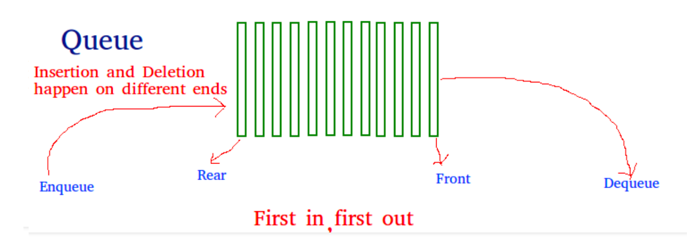
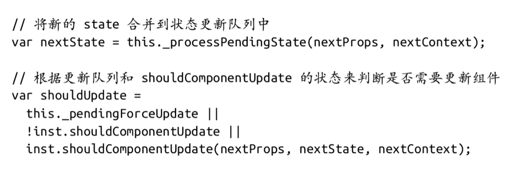
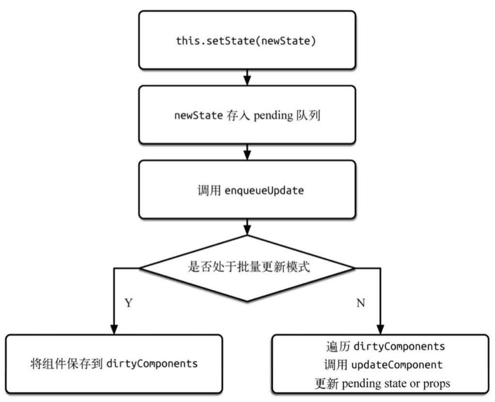
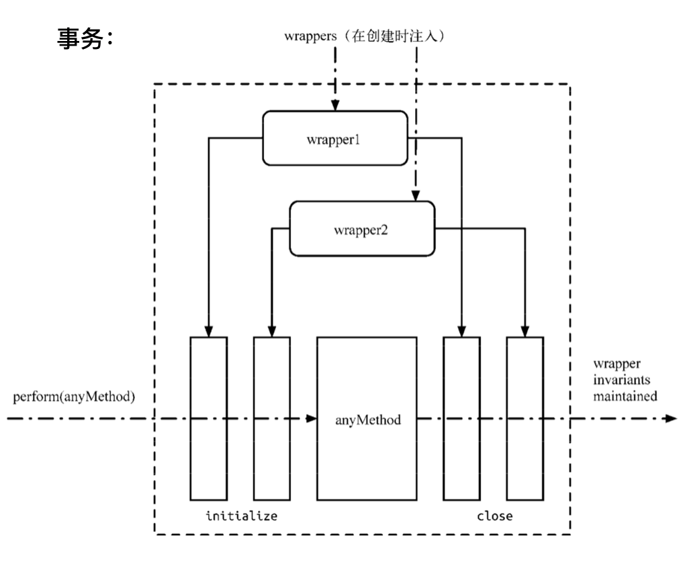
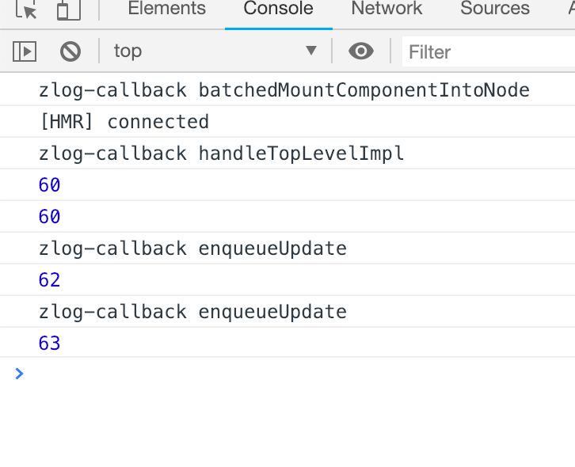
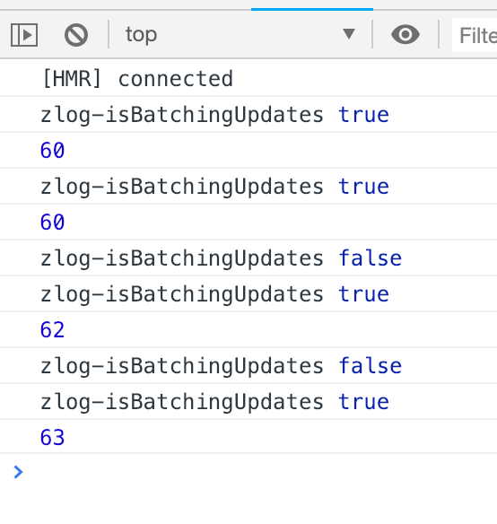

# React 视图更新机制浅析

> 参考《深入react技术栈》第三章 基于React v15.0.2

这里我主要介绍三部分内容。

## 一：setSate异步更新

zmy-log 截图

state 是 React 中重要的概念。React 是通过管理状态来实现对组件的管理。它通过 this.state 来访问 state，通过 this.setState() 方法来更新 state。当this.setState() 被调用的时候，React 会重新调用 render 方法来重新渲染 UI。
setState 虽然已经是我们很熟悉的 API，但你真的了解它吗?比如为什么不能用 `this.state.val` 来更新state呢？接下来就让我们探索一下setState的更新机制。

首先如果你用 `this.state.val` 来更新state，那这其实是不会重新render的，再者，正常state更新是加入一个队列，之后在某段时刻，批量更新，



队列是一种先进先出的数据结构，与之相对的是栈：他是后进先出的。其实这就和我们排队吃饭类似，新加入队列叫 `enqueue` ，出队叫 `dequeue` 

`setState` 就是通过一个队列机制实现 state 更新。当执行 `setState` 时，会将需要更新的 state 合并 后放入状态队列，而不会立刻更新 this.state，队列机制可以高效地批量更新 state。如果不通过 `setState` 而直接修改 this.state 的值，那么该 state 将不会被放入状态队列中，当下次调用 `setState` 并对状态队列进行合并时，将会忽略之前直接被修改的 state，而造成无法预知的错误。

同时 React 也正是利用状态队列机制实现了 setState的异步更新，避免频繁地重复更新 state。相关代码如图：



纸上得来终觉浅，绝知此事要躬行。要从实际代码中才能懂得其中原理，你觉得这段代码点击add时控制台会输出什么呢？

```js
class State01 extends Component {
  state = { num: 60 }

  handleClick = () => {
    this.setState({ num: this.state.num + 1 });
    console.log(this.state.num);
    this.setState({ num: this.state.num + 1 });
    console.log(this.state.num);
  }
  
  render() {
    const { num } = this.state;
    return (
      <div className='state01'>
        <h1>头发： {num}</h1>
        <button onClick={this.handleClick}>Add</button>
      </div>
    );
  }
}
```
控制台输出了 `60 60`

为什么是这种输出呢？其实刚才也说了，setstate是异步更新的，所以这种输出也情有可原，因为 state 批量更新，即2次state都是 60 那么他们就都是 60。
那么，如果把 `handleClick` 改成这样呢？

```js
handleClick = () => {
  this.setState({ num: this.state.num + 1 });
  console.log(this.state.num);
  this.setState({ num: this.state.num + 1 });
  console.log(this.state.num);
  setTimeout(() => {
    this.setState({ num: this.state.num + 1 });
    console.log(this.state.num);
    this.setState({ num: this.state.num + 1 });
    console.log(this.state.num);
  }, 0);
}
```
输出的是：`60 60 62 63`

我们隐约可以发现，其实普通 setState 多次运行时在批量更新中，最后只更新一次，而 setTimeout 中 setState 后就可以马上更新，这是为什么呢？

我们可以查看一下源码，发现，主要流程如图：



我们看下 `enqueueUpdate` 源码：

```js
function enqueueUpdate(component) {
  ensureInjected();

  if (!batchingStrategy.isBatchingUpdates) {
    batchingStrategy.batchedUpdates(enqueueUpdate, component);
    return;
  }

  dirtyComponents.push(component);
}
```

`enqueueUpdate` 调用了 `batchedUpdates`，那继续看下它的源码


```js
batchedUpdates: function (callback, a, b, c, d, e) {
  var alreadyBatchingUpdates = ReactDefaultBatchingStrategy.isBatchingUpdates;

  ReactDefaultBatchingStrategy.isBatchingUpdates = true;

  // The code is written this way to avoid extra allocations
  if (alreadyBatchingUpdates) {
    callback(a, b, c, d, e);
  } else {
    transaction.perform(callback, null, a, b, c, d, e);
  }
}
```

这里调用了 `transaction.perform()` 这个是干什么的呢，其实他是 React 中的事务（这个事务和数据库中的事务可不一样）。事务就是将需要执行的方法使用 `wrapper` 封装起来，再通过事务提供的 `perform` 方法执行。 而在 `perform` 之前，先执行所有 `wrapper` 中的 `initialize` 方法，执行完 `perform` 之后(即执行 `method` 方法后)再执行所有的 `close` 方法。一组 `initialize` 及 `close` 方法称为一个 `wrapper` 。从图中可以看出，事务支持多个 `wrapper` 叠加。



在实现上，事务提供了一个 `mixin` 方法供其他模块实现自己需要的事务。而要使用事务的模块，除了需要把 `mixin` 混入自己的事务实现中外，还要额外实现一个抽象的 `getTransactionWrappers` 接口。这个接口用来获取所有需要封装的前置方法(initialize)和收尾方法(close)， 因此它需要返回一个数组的对象，每个对象分别有 key 为 `initialize` 和 `close` 的方法。

下面是一个简单使用事务的例子:

```js
var Transaction = require('./Transaction');
// 我们自己定义的事务
var MyTransaction = function () {
  // ... };
  Object.assign(MyTransaction.prototype, Transaction.Mixin, {
    getTransactionWrappers: function () {
      return [{
        initialize: function () {
          console.log('before method perform');
        },
        close: function () {
          console.log('after method perform');
        }
      }];
    };
  });
  var transaction = new MyTransaction(); var testMethod = function () {
    console.log('test');
  }
  transaction.perform(testMethod);
}
// 打印的结果如下:
// before method perform // test
// after method perform
```


那么这里使用了什么 `wrapper` 呢，其实有2个，分别是 `RESET_BATCHED_UPDATES` 和 `FLUSH_BATCHED_UPDATES`


```js
var RESET_BATCHED_UPDATES = {
  initialize: emptyFunction,
  close: function () {
    // console.log('zlog-RESET_BATCHED_UPDATES wrapper');
    ReactDefaultBatchingStrategy.isBatchingUpdates = false;
  }
};

var FLUSH_BATCHED_UPDATES = {
  initialize: emptyFunction,
  close: ReactUpdates.flushBatchedUpdates.bind(ReactUpdates)
};
```

`RESET_BATCHED_UPDATES` 是用于更改 `isBatchingUpdates` 的布尔值 false 或者 true ， `FLUSH_BATCHED_UPDATES` 的作用是更新组件。


 `batchedUpdates` 中还调用了 `callback` 我们可以输出看一下回调调用了什么：




这里就是调用了上面的 `enqueueUpdate` 。


我们输出 `isBatchingUpdates` 的值看一下，

```js
function enqueueUpdate(component) {
  ensureInjected();

  // zs01 Batching 递归调用
  console.log('zlog-isBatchingUpdates', batchingStrategy.isBatchingUpdates);
  if (!batchingStrategy.isBatchingUpdates) {
    batchingStrategy.batchedUpdates(enqueueUpdate, component);
    return;
  }

  dirtyComponents.push(component);
}
```

结果如图：




```js

```


```js

```


```js

```


```js

```


## 二：Virtual DOM

## 三：Diff 算法
zmy-3中diff 结合


```js

```
