# React 视图更新机制浅析

> 参考《深入react技术栈》第三章 基于React v15.0.2

这里的内容分为三部分。

## 一：setState异步更新

state 是 React 中重要的概念。React 是通过管理状态来实现对组件的管理。它通过 this.state 来访问 state，通过 this.setState() 方法来更新 state。当this.setState() 被调用的时候，React 会重新调用 render 方法来重新渲染 UI。
setState 虽然已经是我们很熟悉的 API，但你真的了解它吗?比如为什么不能用 `this.state.val` 来更新state呢？接下来就让我们探索一下setState的更新机制。

首先如果你用 `this.state.val` 来更新state，那这其实是不会重新render的，再者，正常state更新是加入一个队列，之后在某段时刻，批量更新，


队列是一种先进先出的数据结构，与之相对的是栈：他是后进先出的。其实这就和我们排队吃饭类似，新加入队列叫 `enqueue` ，出队叫 `dequeue` 

`setState` 就是通过一个队列机制实现 state 更新。当执行 `setState` 时，会将需要更新的 state 合并 后放入状态队列，而不会立刻更新 this.state，队列机制可以高效地批量更新 state。如果不通过 `setState` 而直接修改 this.state 的值，那么该 state 将不会被放入状态队列中，当下次调用 `setState` 并对状态队列进行合并时，将会忽略之前直接被修改的 state，而造成无法预知的错误。

同时 React 也正是利用状态队列机制实现了 setState的异步更新，避免频繁地重复更新 state。相关代码如图：


纸上得来终觉浅，绝知此事要躬行。要从实际代码中才能懂得其中原理，你觉得这段代码点击add时控制台会输出什么呢？

```js
class State01 extends Component {
  state = { num: 60 }

  handleClick = () => {
    this.setState({ num: this.state.num + 1 });
    console.log(this.state.num);
    this.setState({ num: this.state.num + 1 });
    console.log(this.state.num);
  }
  
  render() {
    const { num } = this.state;
    return (
      <div className='state01'>
        <h1>头发： {num}</h1>
        <button onClick={this.handleClick}>Add</button>
      </div>
    );
  }
}
```
控制台输出了 `60 60`

为什么是这种输出呢？其实刚才也说了，setstate是异步更新的，所以这种输出也情有可原，因为 state 批量更新，即2次state都是 60 那么他们就都是 60。
那么，如果把 `handleClick` 改成这样呢？

```js
handleClick = () => {
  this.setState({ num: this.state.num + 1 });
  console.log(this.state.num);
  this.setState({ num: this.state.num + 1 });
  console.log(this.state.num);
  setTimeout(() => {
    this.setState({ num: this.state.num + 1 });
    console.log(this.state.num);
    this.setState({ num: this.state.num + 1 });
    console.log(this.state.num);
  }, 0);
}
```
输出的是：`60 60 62 63`

我们隐约可以发现，其实普通 setState 多次运行时在批量更新中，最后只更新一次，而 setTimeout 中 setState 后就可以马上更新，这是为什么呢？

我们可以查看一下源码，发现，主要流程如图：


我们看下 `enqueueUpdate` 源码：

```js
function enqueueUpdate(component) {
  ensureInjected();

  if (!batchingStrategy.isBatchingUpdates) {
    batchingStrategy.batchedUpdates(enqueueUpdate, component);
    return;
  }

  dirtyComponents.push(component);
}
```

`enqueueUpdate` 调用了 `batchedUpdates`，那继续看下它的源码


```js
batchedUpdates: function (callback, a, b, c, d, e) {
  var alreadyBatchingUpdates = ReactDefaultBatchingStrategy.isBatchingUpdates;

  ReactDefaultBatchingStrategy.isBatchingUpdates = true;

  // The code is written this way to avoid extra allocations
  if (alreadyBatchingUpdates) {
    callback(a, b, c, d, e);
  } else {
    transaction.perform(callback, null, a, b, c, d, e);
  }
}
```

这里调用了 `transaction.perform()` 这个是干什么的呢，其实他是 React 中的事务（这个事务和数据库中的事务可不一样）。事务就是将需要执行的方法使用 `wrapper` 封装起来，再通过事务提供的 `perform` 方法执行。 而在 `perform` 之前，先执行所有 `wrapper` 中的 `initialize` 方法，执行完 `perform` 之后(即执行 `method` 方法后)再执行所有的 `close` 方法。一组 `initialize` 及 `close` 方法称为一个 `wrapper` 。从图中可以看出，事务支持多个 `wrapper` 叠加。


在实现上，事务提供了一个 `mixin` 方法供其他模块实现自己需要的事务。而要使用事务的模块，除了需要把 `mixin` 混入自己的事务实现中外，还要额外实现一个抽象的 `getTransactionWrappers` 接口。这个接口用来获取所有需要封装的前置方法(initialize)和收尾方法(close)， 因此它需要返回一个数组的对象，每个对象分别有 key 为 `initialize` 和 `close` 的方法。

下面是一个简单使用事务的例子:

```js
var Transaction = require('./Transaction');
// 我们自己定义的事务
var MyTransaction = function () {
  // ...
};
Object.assign(MyTransaction.prototype, Transaction.Mixin, {
  getTransactionWrappers: function () {
    return [{
      initialize: function () {
        console.log('before method perform');
      },
      close: function () {
        console.log('after method perform');
      }
    }];
  }
});
var transaction = new MyTransaction(); var testMethod = function () {
  console.log('test');
}
transaction.perform(testMethod);
// 打印的结果如下:
// before method perform
// test
// after method perform
```


那么这里使用了什么 `wrapper` 呢，其实有2个，分别是 `RESET_BATCHED_UPDATES` 和 `FLUSH_BATCHED_UPDATES`


```js
var RESET_BATCHED_UPDATES = {
  initialize: emptyFunction,
  close: function () {
    // console.log('zlog-RESET_BATCHED_UPDATES wrapper');
    ReactDefaultBatchingStrategy.isBatchingUpdates = false;
  }
};

var FLUSH_BATCHED_UPDATES = {
  initialize: emptyFunction,
  close: ReactUpdates.flushBatchedUpdates.bind(ReactUpdates)
};
```

`RESET_BATCHED_UPDATES` 是用于更改 `isBatchingUpdates` 的布尔值 false 或者 true ， `FLUSH_BATCHED_UPDATES` 的作用是更新组件。


 `batchedUpdates` 中还调用了 `callback` 我们可以输出看一下回调调用了什么：


这里就是调用了上面的 `enqueueUpdate` 。


我们可以看一下这2中执行setState方法的调用栈是怎么样的：


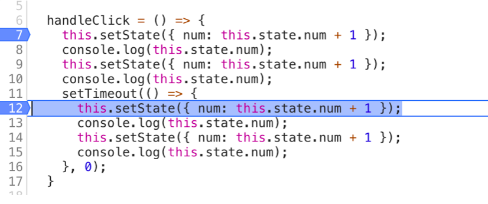

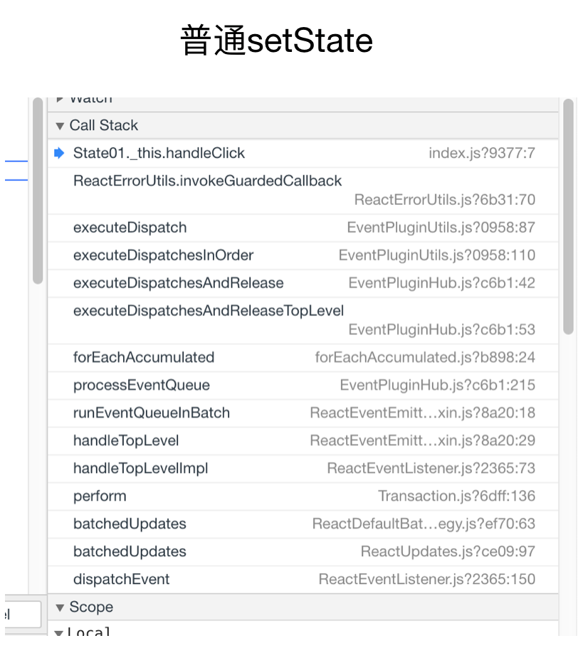

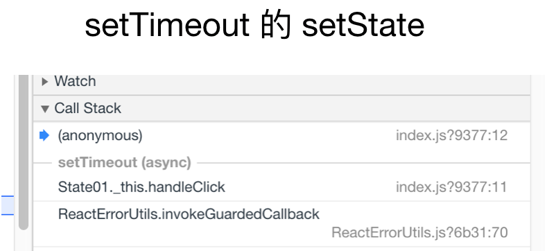

可以看到， setTimeout 时，它的代码在另一个调用栈中，即在 event queue 中，那么他们的上下文环境就不同。

因为在 普通调用 `setState` 时， `batchingStrategy` 的 `isBatchingUpdates` 已经被设为 true，所以两次 `setState` 的结果并没有立即生效，而是被放进 了 `dirtyComponents` 中。这也解释了两次打印都是 60 的原因，因为新的 state 还没有被应用到组件中

而 setTimeout 中 的 两 次 `setState` ， 因 为 没 有 前 置 的 `batchedUpdate` 调 用 ， 所 以 `batchingStrategy` 的 `isBatchingUpdates` 标志位是 false，也就导致了新的 state 马上生效，没有 走到 `dirtyComponents` 分支

我们可以输出 `isBatchingUpdates` 的值看一下，验证一下我们的想法

```js
function enqueueUpdate(component) {
  ensureInjected();

  // zs01 Batching 递归调用
  console.log('zlog-isBatchingUpdates', batchingStrategy.isBatchingUpdates);
  if (!batchingStrategy.isBatchingUpdates) {
    batchingStrategy.batchedUpdates(enqueueUpdate, component);
    return;
  }

  dirtyComponents.push(component);
}
```

结果如图：


那么 `setState` 的介绍就到这里，接下来我们看 `virtual dom`。


## 二：Virtual DOM


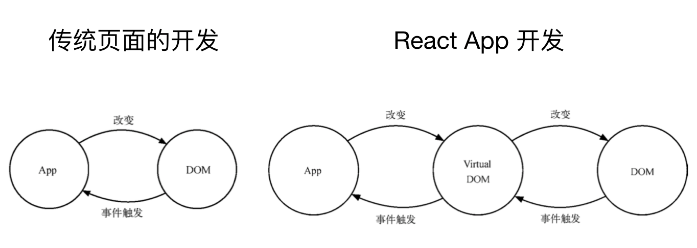


真实页面对应一个 DOM 树。在传统页面的开发模式中，每次需要更新页面时，都要手动操作 DOM 来进行更新。
而 react app 每次数据更新后，重新计算 Virtual DOM，并和上一次生成的 Virtual DOM 做对比，对发生 变化的部分做批量更新。React 也提供了直观的 `shouldComponentUpdate` 生命周期回调，来减少数 据变化后不必要的 Virtual DOM 对比过程，以保证性能。 
但vdom不止就这一个优点，它还方便和其他平台集成，比如 react-native 是基于 Virtual DOM 渲染出原生控件，因为 React 组件可以映射为对应的原生控件。在输出的时候，是输出 Web DOM，还 是 Android 控件，还是 iOS 控件，就由平台本身决定了。

其实，构建一套简易 Virtual DOM 模型并不复杂，它只需要具备一个 DOM 标签所需的基本元素即可:

```js
{
  // 标签名 
  tagName: 'div',
  // 属性 
  properties: {
    // 样式
    style: {}
  },
  // 子节点 
  children: [],
  // 唯一标识 
  key: 1
}
```

可以直接输出一个JSX的标签看一下：

```js
const t = <div className='world'>hello</div>;
console.log(t);
```

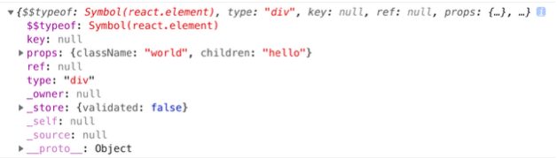


Virtual DOM 对于 React，就好像一个虚拟空间，React 的所有工作几乎都是基于 Virtual DOM 完成的。其中，Virtual DOM 模型拥有一整套的 Virtual DOM 标签。

Virtual DOM 中的节点称为 ReactNode，它分为3种类型 ReactElement、ReactFragment 和 ReactText。其中，ReactElement 又分为 ReactComponentElement 和 ReactDOMElement。

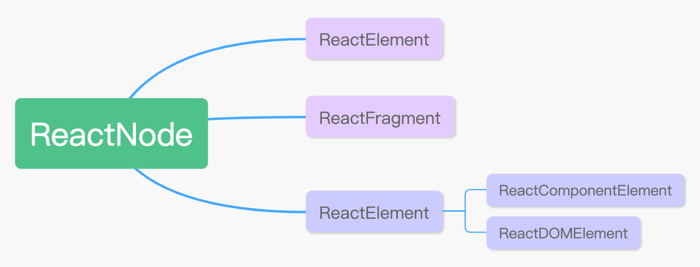

我们写的jsx最后都会被编译成 `React.createElement` 方法，那 `createElement` 做了什么呢？createElement 只是做了简单的参数修正，返回一个 ReactElement 实例对象，也就是虚拟元素的实例，所以Virtual DOM 模型通过 createElement 创建虚拟元素。

当使用 React 创建组件时，首先会调用 `instantiateReactComponent` ，这是初始化组件的入口函数，它通过判断 node 类型来区分不同组件的入口。

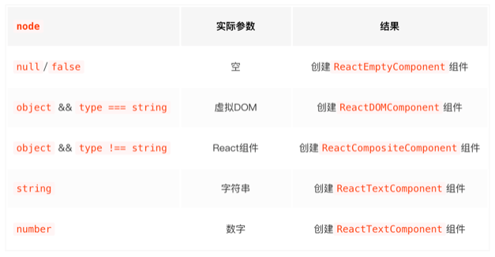

ReactCompositeComponent 自定义组件实现了一整套 React 生命周期和 setState 机制，因此自定义组件是在生命周期的环境中进行更新属性、内容和子节点的操作。也是我们最常用的组件类型。

故 React 通过 vdom 生成HTML的过程大致如图：

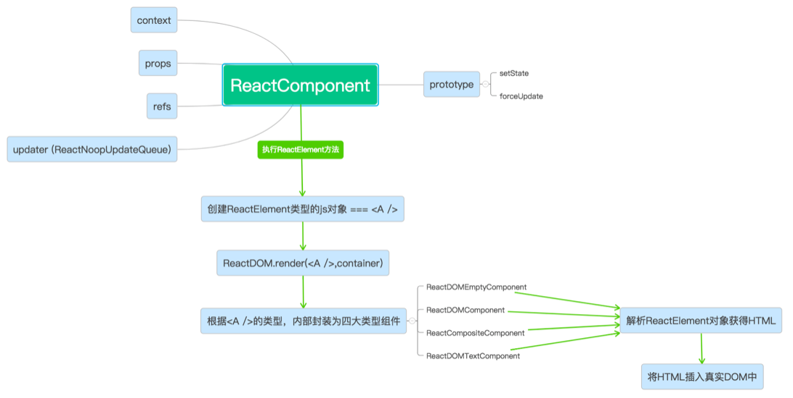


## 三：Diff 算法


Diff 算法的目的是通过尽量少的操作把一颗树转换成另一棵树。

计算一棵树形结构转换成另一棵树形结构的最少操作，是个复杂的问题。传统 diff 算法通过循环递归对节点进行依次对比，传统diff算法：O(n^3)。React 将 Virtual DOM 树转换成 actual DOM 树的最少操作的过程称为调和(reconciliation)。 diff 算法便是调和的具体实现。

React diff算法是启发式算法，那什么是启发式算法呢，可以看一下[知乎](https://www.zhihu.com/topic/19864220/intro)上的解释：

> 启发式算法（heuristic algorithm)是相对于最优化算法提出的。一个问题的最优算法求得该问题每个实例的最优解。启发式算法可以这样定义：一个基于直观或经验构造的算法，在可接受的花费（指计算时间和空间）下给出待解决组合优化问题每一个实例的一个可行解，该可行解与最优解的偏离程度一般不能被预计。


React 通过制定大胆的策略，将 O(n^3) 复杂度的问题转换成 O(n) 复杂度的问题。基于以上策略，React 分别对 tree diff、component diff 以及 element diff 进行算法优化。事实也证明这 3 个前提策略是合理且准确的，它保证了整体界面构建的性能。

React diff 算法有 3 个策略。

- 策略一:Web UI 中 DOM 节点跨层级的移动操作特别少，可以忽略不计。
- 策略二:拥有相同类的两个组件将会生成相似的树形结构，拥有不同类的两个组件将会生成不同的树形结构。
- 策略三:对于同一层级的一组子节点，它们可以通过唯一 id 进行区分。

基于以上策略，React 分别对 tree diff、component diff 以及 element diff 进行算法优化。

### tree diff

基于策略一，React 对树的算法进行了简洁明了的优化，即对树进行分层比较，两棵树只会对同一层次的节点进行比较。

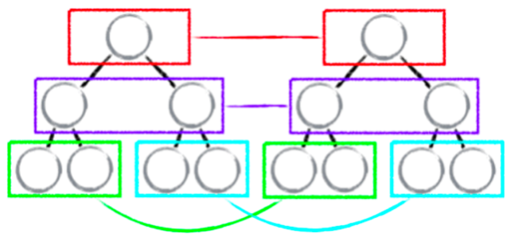

如下图，如果出现了 DOM 节点跨层级的移动操作，A 节点(包括其子节点)整个被移动到 D 节点下，由于 React 只会简单地考虑同层级节点的位置变换，而对于不同层级的节点，只有创建和删除操作。当根节点发现子节点中 A 消失了，就会直接销毁 A;当 D 发现多了一个子节点 A，则会创建新的 A(包括子节点)作为其子节点。此时，diff 的执行情况:create A → create B → create C → delete A。


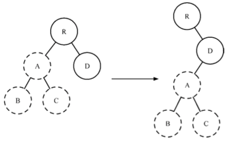

由此可以发现，当出现节点跨层级移动时，并不会出现想象中的移动操作，而是以 A 为根节 点的整个树被重新创建。这是一种影响 React 性能的操作，因此官方建议不要进行 DOM 节点跨层级的操作。所以在可行的情况下，可用css来隐藏或显示节点。


### component diff

React 是基于组件构建应用的，对于组件间的比较所采取的策略也是非常简洁、高效的。

- 如果是同一类型的组件，按照原策略继续比较 Virtual DOM 树即可。
- 如果不是，则将该组件判断为 dirty component，从而替换整个组件下的所有子节点。
- 对于同一类型的组件，有可能其 Virtual DOM 没有任何变化，如果能够确切知道这点，那么就可以节省大量的 diff 运算时间。因此，React 允许用户通过 shouldComponentUpdate() 来判断该组件是否需要进行 diff 算法分析。

如下图，当组件 D 变为组件 G 时，即使这两个组件结构相似，一旦 React 判断 D 和 G 是不同类型的组件，就不会比较二者的结构，而是直接删除组件 D，重新创建组件 G 及其子节点。虽然当两个组件是不同类型但结构相似时，diff 会影响性能，但不同类型的组件很少存在相似 DOM 树的情况，因此这种极端因素很难在实际开发过程中造成重大的影响。

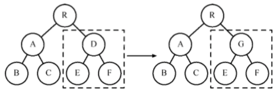

### element diff

当节点处于同一层级时，diff 提供了 3 种节点操作，分别为 INSERT_MARKUP(插入)、MOVE_EXISTING(移动)和REMOVE_NODE(删除)。

- INSERT_MARKUP:新的组件类型不在旧集合里，即全新的节点，需要对新节点执行插入操作。
- MOVE_EXISTING:旧集合中有新组件类型，且 element 是可更新的类型，generateComponent- Children 已调用receiveComponent，这种情况下 prevChild=nextChild，就需要做移动操作，可以复用以前的 DOM 节点。
- REMOVE_NODE:旧组件类型，在新集合里也有，但对应的 element 不同则不能直接复用和更新，需要执行删除操作，或者旧组件不在新集合里的，也需要执行删除操作。

React 允许开发者对同一层级的同组子节点，添加唯一 key 进行区分，这样就可以避免相同元素，位置不同时的性能消耗。

有了key之后，就可以通过唯一的key判断新旧集合中是否存在相同的节点，如果存在，只进行移动操作即可，但在移动前需要将当前节点在旧集合中的位置与 lastIndex 进行比较 `if (child._mountIndex < lastIndex)` ，否则不执行该操作。这是一种顺序优化手段，lastIndex 一 直在更新，表示访问过的节点在旧集合中最右的位置(即最大的位置)。如果新集合中当前访问 的节点比 lastIndex 大，说明当前访问节点在旧集合中就比上一个节点位置靠后，则该节点不会 影响其他节点的位置，因此不用添加到差异队列中，即不执行移动操作。只有当访问的节点比 lastIndex 小时，才需要进行移动操作。

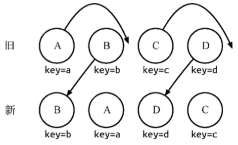

1. 从新集合中取得 B，然后判断旧集合中是否存在相同节点 B，此时发现存在节点 B，接着通过对比节点位置判断是否进行移动操作。B 在旧集合中的位置 B._mountIndex = 1，此时 lastIndex = 0，不满足 child._mountIndex < lastIndex 的条件，因此不对 B 进行移动 操作。更新 lastIndex = Math.max(prevChild._mountIndex, lastIndex)，其中 prevChild._mountIndex 表示B在旧集合中的位置，则lastIndex = 1，并将B的位置更新为新集合中的 位置 prevChild._mountIndex = nextIndex，此时新集合中 B._mountIndex = 0，nextIndex++ 进入下一个节点的判断。
2. 从新集合中取得 A，然后判断旧集合中是否存在相同节点 A，此时发现存在节点 A，接着通过对比节点位置判断是否进行移动操作。A 在旧集合中的位置 A._mountIndex = 0，此时 lastIndex = 1，满足 child._mountIndex < lastIndex 的条件，因此对 A 进行移动操作 enqueueMove(this, child._mountIndex, toIndex)，其中 toIndex 其实就是 nextIndex，表示 A 需要移动到的位置。更新 lastIndex = Math.max(prevChild._mountIndex, lastIndex)， 则lastIndex = 1，并将 A 的位置更新为新集合中的位置 prevChild._mountIndex = nextIndex，此时新集合中 A._mountIndex = 1，nextIndex++ 进入下一个节点的判断。
3. 从新集合中取得 D，然后判断旧集合中是否存在相同节点 D，此时发现存在节点 D，接着 通过对比节点位置判断是否进行移动操作。D 在旧集合中的位置 D._mountIndex = 3，此时 lastIndex = 1，不满足 child._mountIndex < lastIndex 的条件，因此不对 D 进行移动操作。更新 lastIndex = Math.max(prevChild._mountIndex, lastIndex)，则 lastIndex = 3，并将 D 的位置更新为新集合中的位置 prevChild._mountIndex = nextIndex，此时新集合中 D._mountIndex = 2，nextIndex++ 进入下一个节点的判断。
4. 从新集合中取得 C，然后判断旧集合中是否存在相同节点 C，此时发现存在节点 C，接着 通过对比节点位置判断是否进行移动操作。C 在旧集合中的位置 C._mountIndex = 2，此时 lastIndex = 3，满足 child._mountIndex < lastIndex的条件，因此对 C 进行移动操作 enqueueMove(this, child._mountIndex, toIndex)。更新lastIndex = Math.max(prevChild._mountIndex, lastIndex)，则 lastIndex = 3，并将 C 的位置更新为新集合中的位置 prevChild._mountIndex = nextIndex，此时新集合中 A._mountIndex = 3，nextIndex++ 进入下一个节点的判断。由于 C 已经是最后一个节点，因此 diff 操作到此完成。

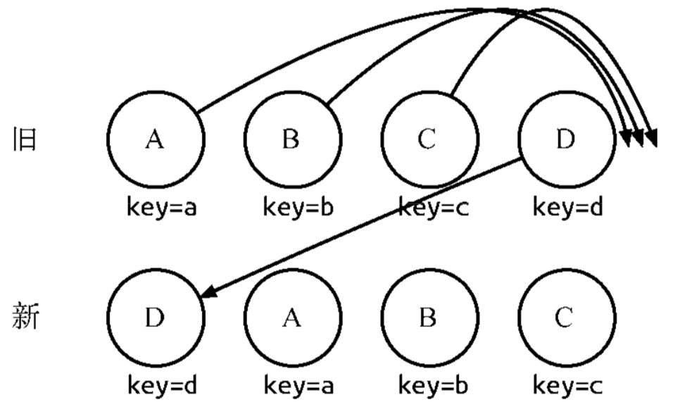

当然，diff 还存在些许不足与待优化的地方。如图，若新集合的节点更新为 D、A、 B、C，与旧集合相比只有 D 节点移动，而 A、B、C 仍然保持原有的顺序，理论上 diff 应该只需 对 D 执行移动操作，然而由于 D 在旧集合中的位置是最大的，导致其他节点的 _mountIndex < lastIndex，造成 D 没有执行移动操作，而是 A、B、C 全部移动到 D 节点后面的现象。

在开发过程中，尽量减少类似将最后一个节点移动到列表首部的操作。当节点数量过大或更新操作过于频繁时，这在一定程度上会影响 React 的渲染性能。


### React Patch 方法

React Patch 就是将 tree diff 计算出来的 DOM 差异队列更新到真实的 DOM 节点上，最终让浏览器能够渲染出更新的数据。如果没有 Patch，那么 React 之前基于 Virtual DOM 做再多性能优化的操作都是徒劳，因为浏览器并不认识 Virtual DOM。虽然 Patch 方法如此重要，但它的实现却非常简洁明了，主要是通过遍历差异队列实现的。遍历差异队列时，通过更新类型进行相应的操作，包括:新节点的插入、已有节点的移动和移除等。

## 总结

这里主要讲了setState 更新机制、Virtual DOM 模型、diff 算法等。也阅读了部分源码，从中可以发现，源码中错误情况处理丰富，注释规范易易懂，值得我们学习。
